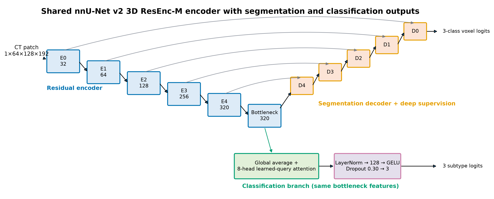

# Multi-task 3D nnU-Net for pancreas CT

This repository contains Amirfaham Fallahpour's implementation for a job take-home assessment: joint pancreas/lesion segmentation and three-class subtype classification from cropped 3D CT volumes. The model is built on **nnU-Net v2 3D ResEnc M**, as required, with one shared encoder and separate segmentation and classification outputs.

> Status (2026-08-05): the production run is active. Validation metrics below remain explicitly pending until they are regenerated from a saved checkpoint on all 36 held-out cases. No estimated score is presented as a result.

## Method at a glance

- **Backbone:** nnU-Net v2.8.1 `ResidualEncoderUNet`, ResEnc M plan.
- **Parameters:** 102,764,274 unique learned parameters (102,268,079 in the nnU-Net segmentation backbone and 496,195 in the classification path).
- **Segmentation output:** background, pancreas (`1`), and lesion (`2`) through the native decoder with deep supervision during training.
- **Classification output:** the 320-channel encoder bottleneck is summarized by global average pooling and learned-query multi-head cross-attention. Their concatenation passes through LayerNorm, a 128-unit GELU MLP, dropout 0.30, and three logits.
- **Joint loss:** native nnU-Net Dice + cross-entropy segmentation loss plus `0.5 ×` class-weighted classification cross-entropy with label smoothing 0.05.
- **Imbalance controls:** inverse-frequency class weights `[1.35484, 0.79245, 1.0]`, 50% foreground oversampling, and a 0.25 weight for subtype loss on training crops containing no lesion voxel.
- **Inference:** explicit local aggregation across mirror views, spatial tiles, and folds. Segmentation logits follow nnU-Net's geometry-restoring exporter; classification probabilities are averaged separately and never spatially resampled.

No external dataset, public pretrained weight, or validation case is used for optimization.



## Supplied data and integrity checks

The de-identified assessment package contains:

| Split | Subtype 0 | Subtype 1 | Subtype 2 | Total |
|---|---:|---:|---:|---:|
| Training | 62 | 106 | 84 | 252 |
| Validation | 9 | 15 | 12 | 36 |
| Test | — | — | — | 72 |

An audit found that 214 of the 288 labeled masks decoded some pancreas voxels as `1.0000152587890625` instead of exact integer `1`. The conversion script repairs only values within a declared `1e-3` distance of `{0,1,2}`, writes `uint8` copies, preserves NIfTI geometry, verifies all image/mask pairings and split disjointness, and never edits the source files. Data and generated medical images are excluded from Git. The compiled submission PDF and source-derived qualitative panel are delivered privately rather than published; aggregate plots and the code used to regenerate every panel remain public.

## Repository layout

```text
configs/experiment.yaml            Frozen experiment choices
src/pancreas_multitask/network.py  ResEnc-M wrapper and classification head
src/pancreas_multitask/trainer.py  Joint loss, metrics, checkpoints, W&B logging
src/pancreas_multitask/predictor.py Explicit joint sliding-window inference
src/pancreas_multitask/classification_rescue.py Frozen-head rescue safeguards
scripts/prepare_dataset.py         Audit and non-destructive nnU-Net conversion
scripts/predict_joint.py           Raw-NIfTI segmentation/classification CLI
scripts/evaluate_predictions.py    Fixed validation metrics and bootstrap CIs
scripts/audit_classification_rescue_activation.py Train-only rescue gate
scripts/validate_submission.py     Strict 72-case directory/ZIP validator
scripts/Package-Submission.ps1     Validate-first atomic delivery packager
scripts/benchmark_training.py      Short CUDA timing/memory probe
tests/                             Data, network, trainer, metric, inference tests
report/report.md                   Artifact-driven technical-report source
docs/AI_WORKFLOW.md                AI attribution and verification workflow
docs/classification_head_rescue.md Predeclared conditional rescue protocol
docs/INTERVIEW_PREP.md             Post-submission technical review notes
```

## Environment

The reported Windows 11 run uses Python 3.12.13, PyTorch 2.8.0+cu128,
torchvision 0.23.0+cu128, nnU-Net v2.8.1,
dynamic-network-architectures 0.4.4, and an NVIDIA GeForce RTX 4060 Laptop
GPU (8,188 MiB). A CUDA tensor allocation test passed.

One reproducible setup using standard-library `venv` is:

```powershell
py -3.12 -m venv D:\MLQuizWork\.venv
D:\MLQuizWork\.venv\Scripts\python.exe -m pip install -r requirements.txt
D:\MLQuizWork\.venv\Scripts\python.exe -m pip install -e . --no-deps
```

The equivalent `uv` setup is:

```powershell
uv venv D:\MLQuizWork\.venv --python 3.12
D:\MLQuizWork\.venv\Scripts\python.exe -m pip install -r requirements.txt
D:\MLQuizWork\.venv\Scripts\python.exe -m pip install -e . --no-deps
```

The default work root is outside the OneDrive repository so checkpoints and preprocessed data are not synchronized or committed.

## Data preparation

Set the nnU-Net paths in the same PowerShell process that will run each command. This host's default execution policy blocks dot-sourcing, so the process-local bypass is intentional:

```powershell
Set-ExecutionPolicy -Scope Process Bypass -Force
. .\scripts\Set-QuizEnvironment.ps1 -WorkRoot D:\MLQuizWork -WandbMode disabled
```

First audit without writing, then create a training-only planning layout:

```powershell
$python = 'D:\MLQuizWork\.venv\Scripts\python.exe'
& $python .\scripts\prepare_dataset.py `
  --source <source-data-root> `
  --output-root D:\MLQuizWork\nnUNet_raw `
  --dataset-id 501 --dataset-name PancreasMultitask `
  --validation-layout separate --dry-run

& $python .\scripts\prepare_dataset.py `
  --source <source-data-root> `
  --output-root D:\MLQuizWork\nnUNet_raw `
  --dataset-id 501 --dataset-name PancreasMultitask `
  --validation-layout separate

& 'D:\MLQuizWork\.venv\Scripts\nnUNetv2_plan_and_preprocess.exe' `
  -d 501 --verify_dataset_integrity --no_pp `
  -pl nnUNetPlannerResEncM -c 3d_fullres -npfp 2
```

Then add the supplied validation cases to the preprocessing layout, while preserving them in `splits_final.json` as held-out cases, and preprocess all cases with the train-derived plan:

```powershell
& $python .\scripts\prepare_dataset.py `
  --source <source-data-root> `
  --output-root D:\MLQuizWork\nnUNet_raw `
  --dataset-id 501 --dataset-name PancreasMultitask `
  --validation-layout imagesTr

& 'D:\MLQuizWork\.venv\Scripts\nnUNetv2_preprocess.exe' `
  -d 501 -plans_name nnUNetResEncUNetMPlans `
  -c 3d_fullres -np 2
```

Copy only the generated manual split into the preprocessed dataset directory
before training. Keep `classification_labels.json` in the raw dataset directory,
where the custom trainer reads it:

```powershell
$preprocessed = 'D:\MLQuizWork\nnUNet_preprocessed\Dataset501_PancreasMultitask'
$split = 'D:\MLQuizWork\nnUNet_raw\Dataset501_PancreasMultitask\splits_final.json'
Copy-Item -LiteralPath $split -Destination $preprocessed -Force
```

## Tests and CUDA smoke test

```powershell
D:\MLQuizWork\.venv\Scripts\python.exe -m pytest -q
```

The historical pre-launch gate had **46 passing tests**; the current expanded
suite has **92 passing tests**. The exact CLI smoke and guarded benchmark were:

```powershell
# Run after the process-scoped environment setup above.
$env:PANCREAS_MT_EPOCHS = '1'
$env:PANCREAS_MT_TRAIN_ITERS = '1'
$env:PANCREAS_MT_VAL_ITERS = '1'
& 'D:\MLQuizWork\.venv\Scripts\nnUNetv2_train.exe' `
  501 3d_fullres 0 `
  -tr nnUNetTrainerPancreasMultiTask `
  -p nnUNetResEncUNetMPlans `
  --disable_checkpointing -device cuda

$env:PANCREAS_MT_EPOCHS = '1'
$env:PANCREAS_MT_TRAIN_ITERS = '5'
$env:PANCREAS_MT_VAL_ITERS = '2'
& 'D:\MLQuizWork\.venv\Scripts\python.exe' `
  .\scripts\benchmark_training.py
```

The real CUDA smoke completed a forward/backward update, logging/checkpoint
hooks, and stock nnU-Net segmentation inference over all 36 validation
volumes. The five-train/two-validation benchmark took 6.13 seconds of epoch
compute; peak CUDA memory was 6,159 MiB allocated and 6,716 MiB reserved.
These are engineering checks, not accuracy results.

## Training

The production configuration is 200 epochs, 125 training updates and 30 validation updates per epoch (25,000 optimizer steps), batch size 2, patch size `64×128×192`, mixed precision, SGD with Nesterov momentum 0.99, initial learning rate 0.01, polynomial decay, weight decay `3e-5`, and gradient-norm clipping at 12. W&B is recorded offline first so authentication cannot interrupt training.

```powershell
Set-ExecutionPolicy -Scope Process Bypass -Force
. .\scripts\Set-QuizEnvironment.ps1 `
  -WorkRoot D:\MLQuizWork -WandbMode offline -DataAugmentationProcesses 1

& 'D:\MLQuizWork\.venv\Scripts\nnUNetv2_train.exe' `
  501 3d_fullres 0 `
  -tr nnUNetTrainerPancreasMultiTask `
  -p nnUNetResEncUNetMPlans -device cuda
```

For an unattended Windows run, the guarded launcher starts the same command in
a hidden process, writes durable stdout/stderr logs under `D:\MLQuizWork\logs`,
and refuses a duplicate matching run. Add `-Resume` only when a verified
`checkpoint_latest.pth` exists.

```powershell
.\scripts\Start-ProductionTraining.ps1 -WandbMode offline
# Recovery only:
.\scripts\Start-ProductionTraining.ps1 -WandbMode offline -Resume
```

This checkpoint-enabled offline-W&B run was launched on 2026-08-05 at 19:25
America/Toronto and is still in progress. Its training-dependent metrics are
not reported as final results.

Online patch metrics are monitoring signals, not the final reported scores.
Because the original high-momentum classification head showed a train-metric
collapse, a [fixed train-only rescue protocol](docs/classification_head_rescue.md)
was committed before any full-volume validation evaluation. If its epoch-40/50
training gate activates, it reinitializes and tunes only the classification
path from `checkpoint_final.pth`; validation cannot activate, stop, or alter it.
The three original checkpoints, plus the rescue only when activated, are then
compared once on the complete fixed validation set before test inference.

Model checkpoints are not committed because they are large and can embed local
provenance. The evaluated checkpoint hash and exact reproduction configuration
are reported; access to weights can be provided to the reviewer if permitted.

## Joint inference and evaluation

The commands below are prepared, but they have not yet been run against a
completed and selected production checkpoint. Their validation outputs and
metrics remain `PENDING`.

```powershell
$model = 'D:\MLQuizWork\nnUNet_results\Dataset501_PancreasMultitask\nnUNetTrainerPancreasMultiTask__nnUNetResEncUNetMPlans__3d_fullres'

D:\MLQuizWork\.venv\Scripts\python.exe .\scripts\predict_joint.py `
  --input <raw-validation-images> --output <validation-output> `
  --model $model --folds 0 --checkpoint checkpoint_final.pth `
  --probability-csv <validation-output>\subtype_probabilities.csv `
  --runtime-json <validation-output>\runtime.json

D:\MLQuizWork\.venv\Scripts\python.exe .\scripts\evaluate_predictions.py `
  --predictions <validation-output> --references <prepared-validation-labels> `
  --classification-predictions <validation-output>\subtype_results.csv `
  --classification-references <classification-manifest.json> `
  --classification-reference-split validation `
  --output-json <validation-metrics.json> `
  --output-csv <validation-case-metrics.csv>

# Repeat prediction/evaluation for every candidate admitted by the mandatory
# train-only activation audit (the original three, plus rescue only if approved),
# then apply the frozen equal-weight selection rule and hash each checkpoint.
D:\MLQuizWork\.venv\Scripts\python.exe .\scripts\select_checkpoint.py `
  --candidate checkpoint_best=<best-metrics.json> `
  --candidate checkpoint_best_multitask=<multitask-metrics.json> `
  --candidate checkpoint_final=<final-metrics.json> `
  --checkpoint checkpoint_best=$model\fold_0\checkpoint_best.pth `
  --checkpoint checkpoint_best_multitask=$model\fold_0\checkpoint_best_multitask.pth `
  --checkpoint checkpoint_final=$model\fold_0\checkpoint_final.pth `
  --output <checkpoint-selection.json>
```

After `checkpoint_final.pth` exists, first create the mandatory activation
artifact. Then take exactly one branch: a negative audit goes directly to the
three-candidate pass, while an affirmative audit requires the completed rescue
and the four-candidate switch. `Run-FinalEvaluation.ps1` rejects the wrong
branch, verifies the relevant checkpoint/audit hashes before inference, refuses
active production or rescue processes, holds a process-lifetime single-instance
mutex, resumes complete prediction cases by default, and deliberately stops
before test inference or ZIP creation:

```powershell
$fold = "D:\MLQuizWork\nnUNet_results\Dataset501_PancreasMultitask\" +
  "nnUNetTrainerPancreasMultiTask__nnUNetResEncUNetMPlans__3d_fullres\fold_0"
$activationPath = Join-Path $fold "classification_rescue_activation.json"
& D:\MLQuizWork\.venv\Scripts\python.exe `
  .\scripts\audit_classification_rescue_activation.py `
  --checkpoint (Join-Path $fold "checkpoint_final.pth") `
  --output $activationPath

$activation = Get-Content -LiteralPath $activationPath -Raw | ConvertFrom-Json
if ($activation.activation_approved) {
  .\scripts\Run-ClassificationRescue.ps1
  .\scripts\Run-FinalEvaluation.ps1 `
    -WorkRoot D:\MLQuizWork -IncludeClassificationRescue
} else {
  .\scripts\Run-FinalEvaluation.ps1 -WorkRoot D:\MLQuizWork
}
```

Do not run both evaluation commands: either invocation performs the single
equal-score selection pass over its complete three- or four-candidate set.

The evaluator reports unweighted case-level mean/std and bootstrap confidence intervals for whole-pancreas Dice (`label > 0`) and lesion Dice (`label == 2`), plus a fixed three-class confusion matrix, per-class precision/recall/F1, accuracy, and macro-F1. Empty reference and prediction receives Dice 1; a one-sided empty set receives 0. Confusion-matrix rows are references and columns are predictions.

## Test package

The required ZIP root contains exactly 72 masks named like `quiz_037.nii.gz` and `subtype_results.csv` with the exact header `Names,Subtype`. Before delivery, validate either the directory or ZIP against the supplied test images:

The guarded packager validates the prediction directory, creates an explicit
flat staged ZIP, validates the staged ZIP before committing it, validates the
committed ZIP again, and records its SHA-256 and audit paths in an atomic JSON
manifest. It refuses to replace an existing archive unless `-Force` is passed:

```powershell
.\scripts\Package-Submission.ps1
# Deliberate replacement of that exact delivery ZIP only:
.\scripts\Package-Submission.ps1 -Force
```

The underlying validator can also be run directly:

```powershell
D:\MLQuizWork\.venv\Scripts\python.exe .\scripts\validate_submission.py `
  <results-directory-or-zip> --test-images <source-test-directory> `
  --output-json <submission-audit.json> --output-csv <submission-audit.csv>
```

## Validation results

| Metric | Undergraduate target | Measured fixed-validation result |
|---|---:|---:|
| Whole-pancreas Dice | ≥ 0.90 | **PENDING** |
| Lesion Dice | ≥ 0.27 | **PENDING** |
| Three-class macro-F1 | ≥ 0.60 | **PENDING** |

The [public W&B run](https://wandb.ai/amirfahamfallahpour1379-university-of-toronto/pancreas-multitask-amirfaham-fallahpour/runs/hrs05iyx) is visible now; its final history, selected checkpoint, dispersion statistics, and qualitative failure analysis will be frozen only after training and the independent evaluator complete.

## AI workflow and attribution

The assessment explicitly requests substantial AI-generated code. OpenAI
Codex generated a majority of the initial implementation and documentation,
proposed tests, and supported debugging, experiment monitoring, evaluation,
and packaging. Amirfaham Fallahpour defined the goal and quality bar, supplied
access and compute, made consequential scope decisions, reviewed the work, and
owns the final submission. AI outputs were treated as untrusted until checked
with data audits, 101 automated tests, real CUDA smoke tests, saved
configuration/checkpoint evidence, and human review; the final deliverables
will additionally require clean archive validation before submission. See
[docs/AI_WORKFLOW.md](docs/AI_WORKFLOW.md).

## Limitations and license

This is an evaluation prototype on de-identified cropped CT regions, not a
clinical device. A single small held-out split cannot establish external
validity across institutions, scanners, or acquisition protocols. Repository
code and documentation are licensed under the [Apache License 2.0](LICENSE);
the assessment data are excluded and are not redistributed under that license.

## Contributing and acknowledgements

This repository is a time-bounded assessment submission. Reproducible bug
reports and focused pull requests are welcome after the evaluation period; do
not attach assessment data, predictions, or credentials. The implementation
builds on nnU-Net v2 and its cited dependencies. OpenAI Codex provided the
substantial AI assistance disclosed above; Amirfaham Fallahpour owns the final
review and submission decisions.
