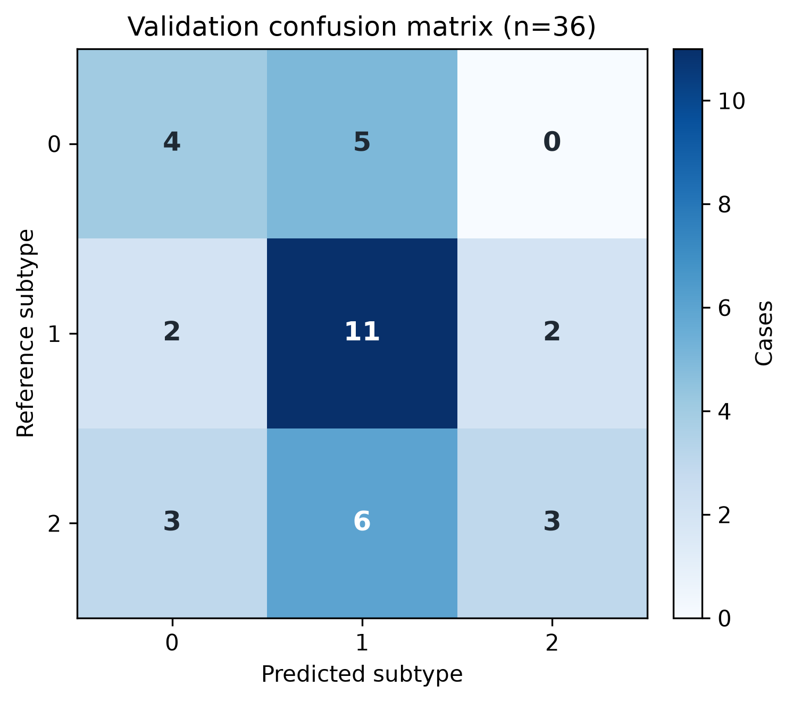

**Public repository:** [github.com/Amirfaham1/pancreas-multitask-nnunet](https://github.com/Amirfaham1/pancreas-multitask-nnunet)

**Weights & Biases:** [joint baseline `hrs05iyx`](https://wandb.ai/amirfahamfallahpour1379-university-of-toronto/pancreas-multitask-amirfaham-fallahpour/runs/hrs05iyx), [v5 train-only experiment `u03yz7ds`](https://wandb.ai/amirfahamfallahpour1379-university-of-toronto/pancreas-multitask-amirfaham-fallahpour/runs/u03yz7ds), [V7 fine-tuning metric archive `uzc4elyc`](https://wandb.ai/amirfahamfallahpour1379-university-of-toronto/pancreas-multitask-v7/runs/uzc4elyc), [V7 independent validation `wrd1f1c8`](https://wandb.ai/amirfahamfallahpour1379-university-of-toronto/pancreas-multitask-v7/runs/wrd1f1c8), [V7 initial inference audit `4wb71b3i`](https://wandb.ai/amirfahamfallahpour1379-university-of-toronto/pancreas-multitask-v7/runs/4wb71b3i), and [V7 final speed audit `uy3u0pff`](https://wandb.ai/amirfahamfallahpour1379-university-of-toronto/pancreas-multitask-v7/runs/uy3u0pff)

**Evaluated V7 code commit:** \artifacthash{9b25aa66f1db53851b5509949366b0735542ab27}

# Introduction

Pancreatic CT analysis in this take-home combines two prediction problems at different spatial scales. Semantic segmentation assigns background, normal-pancreas, or lesion status to every voxel. Subtype classification assigns one of three labels to the complete cropped CT case. A useful model must therefore learn both fine spatial boundaries and a global representation that separates disease subtypes. The supplied images also vary in voxel spacing and appearance, making data-adaptive preprocessing and augmentation important.

The brief mandates nnU-Net v2's 3D ResEnc M configuration, a shared encoder, separate segmentation and classification outputs, W&B tracking for both tasks, explicit classification-imbalance and overfitting strategies, Metrics Reloaded-aligned evaluation, public code, an AI-workflow description, and predictions for 72 test cases. External datasets and pretrained weights are prohibited. The supplied validation split may support monitoring and debugging, but its cases may not be added to training or contribute gradients. The required undergraduate validation targets are whole-pancreas Dice at least 0.90, lesion Dice at least 0.27, and three-class macro-F1 at least 0.60. The master/PhD thresholds are 0.91, 0.31, and 0.70, together with at least 10% faster inference by a method other than disabling test-time augmentation (TTA) or increasing the sliding-window step.

The project targeted both tiers from the outset. The undergraduate thresholds were treated as the minimum complete baseline, while the master/PhD thresholds defined the more ambitious accuracy and efficiency goals. Work was staged to preserve a valid baseline before opening the separately locked higher-tier branch. The original validation result and baseline test package therefore existed before v5, so its official pass is correctly interpreted as a locked post-hoc reevaluation rather than a first-look holdout.

The main technical contributions are:

1. a non-destructive NIfTI audit/conversion pipeline with strict pairing, geometry, split-overlap, and categorical-label checks;
2. a ResEnc M extension with a shared residual encoder, standard nnU-Net decoder, and hybrid global-average/learned-query cross-attention classification branch;
3. an imbalance-aware joint objective and patch-evidence weighting strategy compatible with nnU-Net's patch training;
4. explicit joint sliding-window inference that aggregates segmentation logits and subtype probabilities across mirror views, tiles, and folds without hidden mutable state;
5. a prospectively bounded, best-of-two neural case-head comparison using production-matched frozen features, repeated train-only OOF predictions, and a locked replacement gate;
6. a separate evaluator, deterministic inference-conformance checks, and a strict submission validator; and
7. an auditable AI-assisted workflow that distinguishes candidate ownership from AI-generated implementation.

# Data, integrity, and split control

## Dataset composition

The provided data are de-identified, cropped 3D pancreas CT regions. Cropping makes training possible on modest GPUs, but also removes the full-scan detection/localization problem. Each labelled image is named `quiz_<subtype>_<case>_0000.nii.gz`, and its mask has the same stem without `_0000`. Test filenames omit the hidden subtype. The masks define background `0`, normal pancreas `1`, and pancreatic lesion `2`.

The assessment package does not provide scanner models, acquisition protocols, contrast status, patient demographics, annotation procedure, annotator expertise, or inter-rater measurements. These missing provenance variables limit subgroup and external-validity analysis. No registration is applied because each case contains one CT channel with a paired mask already on the same verified grid. Published pancreatic-CT systems demonstrate the broader promise of deep learning in this domain [2], but their populations and acquisition settings do not establish transfer to this dataset.

| Supplied split | Subtype 0 | Subtype 1 | Subtype 2 | Total |
|---|---:|---:|---:|---:|
| Training | 62 | 106 | 84 | 252 |
| Validation | 9 | 15 | 12 | 36 |
| Test | — | — | — | 72 |

: Supplied case counts and subtype composition. {#tbl:split}

Subtype 1 forms 42.1% of the training set, subtype 2 forms 33.3%, and subtype 0 forms 24.6%. This imbalance is moderate rather than extreme, but an accuracy-only objective could still favor subtype 1. The original joint classifier used inverse-frequency class weights. The v5 head experiment instead used deterministic class-balanced sampling with replacement and unweighted cross-entropy, deliberately avoiding double correction. Both are evaluated with macro-F1 and per-class recall/precision.

All 36 validation references contain both whole-pancreas and lesion foreground. Lesion sizes in the original validation grid range from 673 to 137,595 voxels (median 7,552.5), illustrating why a mean lesion Dice can conceal substantially different small- and large-target behavior.

## Source audit and deterministic label repair

The preparation script first discovers every case and rejects unexpected names, missing image/mask pairs, duplicate identifiers, split overlap, non-3D images, non-finite masks, image/mask shape differences, affine or spacing disagreements, and labels outside the declared set. It reads all 288 labelled image/mask pairs and all 72 test geometries before writing any generated dataset.

The audit found four source mask values: `0.0`, `1.0`, `1.0000152587890625`, and `2.0`. The third value is only $1.52587890625\times10^{-5}$ above one, but nnU-Net's integrity logic treats categorical labels exactly. Across 214 masks, 18,620,040 voxels used this near-integer representation. Passing them through unchanged could fail integrity checking or create an unintended class.

The source data remain immutable. In a separate generated nnU-Net dataset, the converter:

1. requires every mask value to lie within $10^{-3}$ of an integer;
2. rounds only after that check;
3. requires every rounded value to belong to `{0,1,2}`;
4. writes the generated mask as `uint8`; and
5. verifies shape, affine, voxel spacing, qform, and sform against the source.

The maximum observed rounding error was $1.52587890625\times10^{-5}$, well inside the declared tolerance. The generated masks contain exactly 498,469,423 background voxels, 26,396,648 label-1 voxels, and 7,917,460 label-2 voxels. This is a representation repair, not spatial relabelling or resampling. The generated `data_audit.json` and split/classification manifests record counts, values, affected voxels, and case membership.

## Leakage prevention and train-only planning

The supplied folders, rather than a new random split, define fold 0. The generated `splits_final.json` contains 252 training and 36 validation IDs with an empty intersection; all 72 test IDs are also disjoint. Case-level subtype labels are derived once from the labelled source folder and stored as an explicit `case_id -> class_id` mapping. Test identifiers do not encode labels.

A two-phase procedure prevents validation information from entering preprocessing statistics:

1. the training cases are placed in `imagesTr/labelsTr`, while validation cases are initially placed in `imagesVal/labelsVal`;
2. dataset integrity, fingerprint extraction, and ResEnc M planning run on the 252 training cases only;
3. the same converter is rerun with validation cases in `imagesTr/labelsTr`, because nnU-Net preprocessing expects all cases referenced by a manual split there; and
4. all 288 labelled cases are preprocessed using the already-frozen training-only fingerprint and plan.

The produced fingerprint contains 252 cases, and the training log confirms use of the explicit 252/36 split. Validation patches are used for monitoring and checkpoint selection only; they never contribute gradients. No external data or pretrained weights are supplied to the trainer.

## Data governance

The public repository excludes all CT volumes, masks, source-derived qualitative panels, the compiled report containing those panels, model checkpoints, credentials, and local work paths. Code, configuration, tests, documentation, the architecture diagram, and suitably sanitized aggregate plots are published. The final PDF and qualitative panels are delivered privately with the take-home submission. The supplied images are de-identified, but that does not imply a license to redistribute them. This system is an evaluation prototype and not a clinical device.

# Method

## nnU-Net fingerprinting and preprocessing

nnU-Net v2 [1] automatically selects target spacing, patch size, batch size, normalization, and network topology from the dataset fingerprint and the selected ResEnc M memory target. Table 2 records the generated 3D full-resolution plan rather than a hand-written approximation.

| Planning/preprocessing item | Frozen value |
|---|---|
| nnU-Net / planner | nnU-Net v2.8.1 / `nnUNetPlannerResEncM` |
| Configuration / plans name | `3d_fullres` / `nnUNetResEncUNetMPlans` |
| Fingerprint population | 252 training cases only |
| Image reader/writer | `SimpleITKIO` |
| Median original spacing | $2.0\times0.73046875\times0.73046875$ mm |
| Target spacing | $2.0\times0.73046875\times0.73046875$ mm |
| Median resampled shape | $59\times118\times181$ voxels |
| Training patch / batch | $64\times128\times192$ / 2 |
| Image resampling | third-order in-plane/data interpolation; order 0 in separate z handling |
| Label resampling | segmentation-aware order 1; order 0 in separate z handling |
| CT normalization mask | disabled |
| CT clip bounds | training-foreground 0.5th/99.5th percentiles: -55.9961 / 179.9780 |
| CT centering/scaling | training-foreground mean 74.8919; standard deviation 44.0982 |

: Frozen train-only nnU-Net planning and preprocessing configuration. {#tbl:planning}

CT normalization clips intensities to the training-derived percentile bounds, subtracts the training-derived mean, and divides by the training-derived standard deviation. The median axial spacing is much coarser than in-plane resolution; accordingly, the first encoder kernel is $1\times3\times3$ and the first downsampling stride preserves the axial dimension.

## Shared 3D ResEnc M backbone

The segmentation foundation is the planned `ResidualEncoderUNet`, not a smaller custom substitute. It has six residual encoder stages with feature widths `[32, 64, 128, 256, 320, 320]`, encoder block counts `[1, 3, 4, 6, 6, 6]`, and one convolution per decoder stage. Instance normalization with learnable affine parameters and leaky-ReLU activations follow the nnU-Net plan.

For the planned patch, the feature-map sizes progress approximately as

$$
(64,128,192)\rightarrow(64,64,96)\rightarrow(32,32,48)
\rightarrow(16,16,24)\rightarrow(8,8,12)\rightarrow(4,4,6).
$$

The wrapper exposes the original encoder and decoder directly so nnU-Net can still toggle deep supervision. One encoder call produces the complete skip hierarchy. Those same features feed the skip-connected segmentation decoder, while the deepest 320-channel tensor feeds the classification branch. Thus, gradients from both losses update the same encoder parameters. The instantiated model has 102,764,274 unique learned parameters: 90,259,136 in the shared encoder, 12,008,943 in the decoder, and 496,195 in the classification pooling/head path. Counts deduplicate the aliases intentionally exposed for nnU-Net compatibility.

![Implemented multi-task architecture. One six-stage 3D ResEnc M encoder (32, 64, 128, 256, 320, and 320 channels) processes each $1\times64\times128\times192$ CT patch. Its skip features drive the native five-stage nnU-Net decoder and three-class voxel output, with deep supervision used during training. The same 320-channel bottleneck also feeds global-average pooling and eight-head learned-query attention, followed by layer normalization, a 128-unit GELU layer, dropout 0.30, and three subtype logits.](figures/architecture.png){#fig:architecture width=100%}

## Segmentation branch and deep supervision

The standard nnU-Net decoder reconstructs three voxel-logit channels: background, pancreas, and lesion. During training it emits five resolutions. The highest-resolution output and four auxiliary outputs use relative deep-supervision weights `[1, 1/2, 1/4, 1/8, 0]`, normalized to sum to one; the lowest output therefore receives no direct loss. At inference, deep supervision is disabled and only the full-resolution logits are exported. This follows the established deeply supervised learning principle [4].

For each supervised scale, the segmentation loss is the unweighted sum of memory-efficient soft Dice loss (excluding background, smoothing $10^{-5}$) and robust voxel-wise cross-entropy:

$$
L_{seg}=L_{Dice}+L_{CE}.
$$

The nnU-Net implementation represents the overlap term as negative soft Dice,
so this summed optimization objective can legitimately cross below zero as
overlap improves; its absolute sign is not itself a performance metric.

This combination addresses complementary failure modes. Dice reduces sensitivity to the overwhelming number of background voxels, while cross-entropy supplies stable local class supervision. Foreground-aware patch sampling separately increases exposure to pancreatic structures; it is not a replacement for an imbalance-aware loss.

## Hybrid cross-attention classification branch

Let the deepest encoder feature be $B\in\mathbb{R}^{N\times C\times D\times H\times W}$, where $C=320$. The branch deliberately combines a conservative whole-patch summary with a learnable focal summary:

$$
g=\frac{1}{DHW}\sum_{d,h,w}B_{:,:,d,h,w}.
$$

For attention, the spatial dimensions are flattened into $DHW$ tokens, and each token is layer-normalized. A learned query $q\in\mathbb{R}^{1\times C}$ attends to these tokens through eight-head `MultiheadAttention`, following scaled dot-product multi-head attention [6]:

$$
a=\mathrm{LayerNorm}\left(q+\mathrm{MHA}(q,\mathrm{LN}(B),\mathrm{LN}(B))\right).
$$

The pooled vector is `[g ; a]`, with 640 channels. It passes through layer normalization, a 640-to-128 linear layer, GELU, dropout 0.30, and a 128-to-3 linear classifier. Only the newly added head is custom-initialized; the segmentation network retains nnU-Net's initialization. Cross-attention is used because a single query can emphasize a small discriminative region, while the parallel global average path prevents the learned attention from being the only evidence source. This is an architectural rationale, not a claim of improvement: no pooling ablation is reported unless one is actually completed.

The default network call remains segmentation-only so stock nnU-Net tensor operations are not broken. Training and the explicit joint predictor request `(segmentation_logits, classification_logits)` through a separate argument, and tests enforce both contracts.

## Joint loss, class imbalance, and patch evidence

The training subtype counts $(62,106,84)$ yield inverse-frequency weights

$$
w_c=\frac{N}{K n_c}=(1.3548387,\;0.7924528,\;1.0000000).
$$

The classifier uses three-class cross-entropy with these weights and label smoothing $\epsilon=0.05$ [5]. Label smoothing discourages extreme confidence on a small dataset. Because nnU-Net trains on patches while subtype is a case label, not every crop contains equally direct lesion evidence. For sample $i$, a reliability factor is set to $r_i=1.0$ if its highest-resolution target patch contains label 2 and $r_i=0.25$ otherwise. The batch classification loss is

$$
L_{cls}=\frac{\sum_i r_i\,CE_{w,\epsilon}(z_i,y_i)}{\sum_i r_i}.
$$

Non-lesion patches retain a non-zero contribution because surrounding pancreas and context may still be informative; they are not discarded. This heuristic also has a limitation: lesion presence is available only during training, and some subtype evidence may be diffuse rather than localized. Its value is therefore treated as a design choice, not an established causal improvement.

The joint objective is

$$
L_{total}=L_{seg}+0.5L_{cls}.
$$

The 0.5 classification coefficient is a conservative fixed weighting intended to add case supervision without overwhelming the dense segmentation task. No test data are used to tune it, and no claim of optimality is made. W&B logs both components independently so task dominance or divergence remains visible.

## Optimization and augmentation

Table 3 gives the exact launched-run configuration. The 200-epoch cap was selected from measured CUDA throughput to balance optimization depth and available compute; each epoch is also defined explicitly in iterations, so “epoch” does not mean one complete pass over all cases.

| Item | Launched configuration |
|---|---|
| Maximum epochs | 200 |
| Training / validation iterations per epoch | 125 / 30 |
| Batch / patch | 2 / $64\times128\times192$ |
| Optimizer | SGD, momentum 0.99, Nesterov enabled |
| Initial learning rate | 0.01 |
| Schedule | polynomial decay, $lr(e)=0.01(1-e/200)^{0.9}$ |
| Weight decay | $3\times10^{-5}$ |
| Precision | CUDA automatic mixed precision with gradient scaling |
| Gradient clipping | global norm 12 |
| Gradient accumulation | none |
| Foreground oversampling | 50% of patches |
| Deep supervision | enabled during training; disabled for inference |
| PyTorch compilation | disabled |
| Training determinism | not guaranteed; fixed split, stochastic augmentation/CUDA |

: Exact production-training configuration. {#tbl:training-config}

The training transform uses nnU-Net v2.8.1's standard 3D pipeline: rotation up to $\pm 30^{\circ}$ with probability 0.2; synchronized scaling in `[0.7,1.4]` with probability 0.2; Gaussian noise (0.1); Gaussian blur (0.2); multiplicative brightness (0.15); contrast (0.15); simulated low resolution (0.25); inverted gamma (0.1); ordinary gamma (0.3); and mirroring over all three spatial axes. Elastic deformation is disabled by the inherited configuration. The fixed validation loader performs no stochastic intensity or spatial augmentation.

No global deterministic training seed is forced by the launched trainer. The supplied split itself is deterministic, but the exact optimization path is not bitwise reproducible across reruns. This is reported as a limitation rather than labelling the configuration “seed 12345”; 12345 is used only for deterministic evaluation bootstrapping.

## Overfitting controls

The model is high-capacity relative to 252 cases, and a case label is repeated over multiple patches. The enabled controls are:

- extensive spatial and intensity augmentation;
- a compact 128-unit classification hidden layer rather than a large fully connected stack;
- dropout 0.30 and label smoothing 0.05 in the classifier;
- weight decay $3\times10^{-5}$;
- separate monitoring of segmentation and classification train/validation losses;
- per-class F1 and validation-case coverage, which expose majority-class shortcuts and incomplete patch coverage;
- a fixed supplied validation split and prohibition on adding those cases to training; and
- a small, declared checkpoint candidate set rather than selecting individual test outputs.

The trainer does not use automated early stopping. The joint run completed the predeclared 200 epochs; no early stopping was used. The later 30-epoch experiment was a separate frozen-backbone, head-only rescue and is not counted as joint epochs 201--230. Repeated design choices informed by the same 36 validation cases can still overfit the development process even though those cases never receive gradients.

# Experiment protocol and inference

## Development checks across the run

Training-critical contracts were tested before launch: case-ID-to-subtype mapping, inverse-frequency weights, patch-evidence weighting, attention-head compatibility, network tensor shapes, gradient flow into the shared encoder, segmentation-only compatibility, categorical mask repair, and fixed-split generation. Metric, full-volume inference, checkpoint-selection, report-figure, and archive contracts were added and tested before their corresponding downstream stages; some of that hardening occurred while the long training process was already running. These later checks cover macro-F1 and evaluation conventions, mirror/tile/fold classification aggregation, atomic GPU-to-CPU inference retry, complete-checkpoint selection, report-figure generation, and final archive structure. At the evaluated implementation commit, all 193 repository tests pass; the four emitted warnings are deprecation warnings inside the third-party `batchgenerators` package rather than test failures.

A full planned-patch CUDA forward/backward smoke test used batch size 2 on the RTX 4060 Laptop GPU and completed within the 8 GB device budget. The production training log additionally confirms that a complete multi-task training/validation epoch finished without an out-of-memory failure.

## W&B and in-training monitoring

The run records configuration and both task streams through nnU-Net's W&B-compatible logger. Logged signals include total training/validation loss, segmentation and classification component losses, learning rate, native per-class patch Dice, whole-pancreas patch micro-Dice, classification accuracy, case-aggregated patch macro-F1 and per-class F1, validation case coverage, fraction of patches containing lesion, epoch duration, and a multi-task checkpoint score.

These in-training validation signals are intentionally called *patch diagnostics*. Thirty validation iterations at batch size two sample 60 patches, and repeated patch logits are averaged per observed case. The case-coverage field reveals whether all 36 cases appeared that epoch. Patch Dice and patch-aggregated subtype F1 are useful for learning curves but are not the final reported metrics. Section 5's frozen evaluator instead scores one restored full-volume prediction per validation case.

The final W&B record contains:

- project/run URL: [public W&B run](https://wandb.ai/amirfahamfallahpour1379-university-of-toronto/pancreas-multitask-amirfaham-fallahpour/runs/hrs05iyx);
- run ID: `hrs05iyx`;
- public state `finished`, with exactly 200 canonical history rows at steps 0--199 and no duplicate steps;
- a complete ten-field sanitized `full_volume/*` summary for the selected fixed-validation result; and
- a credential-free evidence export whose canonical CSV has SHA-256 \artifacthash{e13644b2330ec95f6a1701786ed30e13b6801e0f2d98a477ae0d0f18407fb59f}.

The ten series used in Figures 2 and 3 match the canonical W&B history sample-for-sample and bit-for-bit. They are deterministic checkpoint-backed renderings, not dashboard screenshots. The separate head-only rescue is retained in immutable audit JSON and is not relabelled as epochs 200--229 in the joint W&B history.

{#fig:loss-curves width=100%}

{#fig:validation-curves width=100%}

## Predeclared conditional classification-head rescue

Online patch diagnostics had already indicated classification collapse before this contingency was specified; the rescue is therefore not presented as a blinded design choice. It was nevertheless frozen and committed before any custom restored full-volume prediction or evaluation on the fixed validation set. The train-only epoch-40 gate was affirmative: mean classification CE was 1.11514384, mean training-patch accuracy was 0.3236, and the CE slope was $-0.000249559$ per epoch. These satisfied the predeclared activation thresholds, and the original 200-epoch joint run then completed before rescue execution.

Activation is determined only from classification CE and training-patch accuracy saved in the completed joint run. For the ten-epoch window ending at epoch 40, activation requires all three predeclared conditions: mean training classification CE at least 1.05, mean training-patch accuracy at most 0.42, and an ordinary-least-squares CE slope at least $-0.001$ per epoch. If that rule is negative, the hard audit of the ten-epoch window ending at epoch 50 activates when either mean training CE is above 1.03 or mean training-patch accuracy is below 0.45. The audit is bound by SHA-256 to `checkpoint_final.pth`. If neither gate activates, later fixed-validation results cannot activate the rescue.

Even if the gate activates at epoch 40 or 50, the original 200-epoch joint run must finish cleanly and `checkpoint_final.pth` remains the fixed initialization. One and only one update-bearing head-only trajectory is allowed: learned-query hybrid pooling and the classification MLP are reinitialized with seed 20260806, then optimized for exactly $30\times125=3{,}750$ successful training-patch updates at batch size 2. The fixed optimizer is AdamW with constant learning rate $3\times10^{-4}$, weight decay $10^{-4}$, and gradient-norm clipping at 1.0. It retains the original training augmentation, foreground oversampling, inverse-frequency class weights, label smoothing 0.05, and non-lesion patch weight 0.25. There is no hyperparameter search or second update-bearing rescue trajectory.

This is not a second round of multi-task fine-tuning. Every encoder and decoder parameter is frozen, both modules remain in evaluation mode, the frozen encoder bottleneck is computed under `no_grad`, and the decoder forward path is bypassed. Exact component hashes before and after optimization verify that the encoder and decoder did not change. The rescue loader indexes only the 252 training keys. The shared 288-case classification metadata is parsed and range-validated, but only training-key labels are indexed into rescue targets or losses; no validation image, segmentation volume, batch, gradient, or stopping signal is consumed. Exact training and validation case-ID hashes are additionally bound to the frozen pretraining split manifest. Validation cannot activate, initialize, stop, extend, restart, or otherwise tune the rescue schedule.

**Numerical guard and correction.** The finite-loss guard rejected a non-finite gradient before the first optimizer step, so no model update or checkpoint was produced by that process. Before fixed-validation comparison, only the numerical execution path was changed: the frozen encoder retained CUDA autocast, while the detached bottleneck and trainable classification forward/loss/backward path used FP32. Model, data, seed, optimizer, and schedule choices remained fixed. The successful update-bearing trajectory and both process logs are retained in the audit.

## Checkpoint production and final selection

The joint run retains three original checkpoint types:

1. nnU-Net's stock `checkpoint_best.pth`, selected by exponential moving average of mean foreground patch Dice;
2. `checkpoint_best_multitask.pth`, saved whenever
   $$
   S_{epoch}=\tfrac12(\text{mean foreground patch Dice}+\text{patch-aggregated macro-F1})
   $$
   improves; and
3. `checkpoint_final.pth`, representing the last completed epoch.

Checkpoint evaluation is deliberately a single three-or-four-candidate custom joint full-volume pass. If the train-only gate is negative, the three original checkpoints are each evaluated once. If the gate is affirmative and the single fixed rescue completes, `checkpoint_classification_rescue.pth` is added and all four candidates are each evaluated once under identical inference and evaluator settings. Stock nnU-Net segmentation-only validation ran on the final joint model during trainer teardown, and its mean foreground Dice was observed before recovery authorization but was not used to drive recovery; no preliminary custom joint candidate pass occurred before rescue completion, and the candidate comparison cannot feed back into rescue optimization.

The test set never influences checkpoint selection. Each eligible candidate is evaluated with restored full-volume predictions on the fixed validation set, and the final score is predeclared as

$$
S_{final}=\tfrac13(\overline{DSC}_{whole}+\overline{DSC}_{lesion}+Macro\text{-}F1).
$$

The candidate with the largest equal-weight score is selected; this prevents the much easier whole-organ task from being the only selection signal. The selected artifact is `checkpoint_classification_rescue.pth`, with SHA-256 \artifacthash{d7248e8903fd1f062687ae33a22ad0374ca1b9927445443dcde55dcde128d116}.

## Post-baseline v5 neural case-head protocol

The original 36-case validation metrics above had been observed and the baseline 72-case test package had already been generated when the submission window was extended. The v5 work is therefore a post-baseline extension motivated by a known classification weakness. Before any eligible v5 feature extraction or neural-head training, the allowed model family, two candidates, training schedule, OOF selection rule, class-offset rule, data boundary, and replacement gate were frozen in machine-readable locks. The neural-head lock has SHA-256 \artifacthash{a8c2147493718acc96e4aa5dc471bf3f3277f0b99e8a8f7620bf966ab7b70d11}; the decision lock has SHA-256 \artifacthash{e28a303c7d3da5dc7857ecc72787b6746d1e689e83167c500d4d2823c5ea540f}. The original rescue checkpoint, encoder, decoder, and rescue classification path remained frozen. A classical feature diagnostic was explicitly ineligible as the primary assignment candidate.

V5 development scripts were restricted to the 252 supplied training cases with counts 62/106/84. They opened no official validation image, mask, label, or metric and no test data; they did not read combined train/validation metadata. This v5-specific boundary must not be generalized to the complete project history: the frozen source checkpoint had already been selected using the original official validation pass, and its shared encoder and rescue head had been trained using all 252 training labels. Consequently, the v5 head OOF results compare two new heads fairly under a common representation, but they are not unbiased end-to-end generalization estimates.

## Production-matched frozen case representation

The feature extractor used the production nnU-Net preprocessing, sliding-window tiling, Gaussian weighting, and eight mirror views. Tiles were ranked by the model's own predicted lesion probability, never by a reference mask, and at most the three highest-mass tiles were retained. Each retained tile contains a pooled $256\times4\times4\times6$ stage-3 encoder map plus aligned model-predicted lesion and whole-pancreas probability maps. A 646-value case summary concatenates the frozen rescue logits and probabilities with a uniform stage-5 mean and a predicted-lesion-mass-weighted stage-5 mean. Case IDs, filenames, paths, and enumeration order were excluded from the numeric model matrix.

The complete extraction processed 252 cases, 641 logical tiles, and 5,128 mirror-view network forwards in 775.317 seconds (3.077 seconds/case) without an out-of-memory fallback. Peak CUDA allocation/reservation was 2,170.228/2,500 MiB. Every one of the 252 per-case caches was rehashed before training. The extraction audit SHA-256 is \artifacthash{db199b4bf00ae7b0c99dfbf8978fb423a31721315dff87c428944bb17059c77b}; the exact cache-manifest and feature-schema hashes are \artifacthash{4e8778af4ae525901519b1249865bea38c5f42466d9f636520610ed1ea6203e7} and \artifacthash{38430f0fbeb27385efac311ba87e175373a1384c41780545682402e6515037b0}.

## Locked best-of-two neural-head comparison

Both eligible heads share a $1\times1\times1$ projection from the 258 spatial channels to 64 channels and a 646-to-64 projection of the case summary. The 117,263-parameter lesion-aware mean-MIL control combines global, lesion-probability-weighted, and whole-pancreas-probability-weighted tile means. The 101,391-parameter attention candidate flattens at most 288 ranked spatial tokens and uses two learned 64-dimensional queries, four-head cross-attention, and a frozen rule that adds a predicted-lesion-mass prior to attention scores. It has no positional encoding and is therefore permutation-invariant with respect to token order apart from the content and lesion-mass prior; spatial relationships beyond the encoder features are not explicitly represented.

Each candidate followed exactly 15 trajectories: five stratified folds for each of three repeat seeds. Every trajectory ran 150 epochs with case batch size 16, 256 sampled cases per epoch, AdamW at $3\times10^{-4}$, weight decay $10^{-4}$, cosine decay to zero, label smoothing 0.05, and gradient clipping at 1.0. Training used deterministic class-balanced sampling with replacement and unweighted cross-entropy. Balanced sampling holds in expectation across draws; individual minibatches are not forced to contain identical class counts. Focal loss was excluded to keep one prospectively fixed loss, and SMOTE was excluded because interpolating high-dimensional learned anatomical features would not create validated biological cases. The balanced sampler was not combined with class-weighted loss.

Selection used the mean complete-OOF macro-F1 across the three repeats, with minimum repeat/class recall as the declared secondary criterion and a 0.01 tie band. There was no early stopping, head choice, schedule change, or stopping decision based on official validation. After selection, the winning architecture was initialized once and refit on all 252 training cases for exactly 150 epochs with the locked seed and schedule.

Amirfaham Fallahpour specifically proposed class-specific thresholding and stronger imbalance handling. Because this is mutually exclusive three-class prediction rather than three separate binary labels, per-class 0.5 thresholds are not coherent. The proposal was implemented as a bounded grid of additive class log-score offsets, cross-fitted on the selected head's train-only OOF logits. Activation required at least 0.01 mean macro-F1 gain and no more than 0.02 loss in the minimum repeat/class recall. This is decision-boundary tuning; no probability-reliability, Brier-score, or log-loss result is claimed. The offset procedure was not nested around neural-head training, which further limits its interpretation.

## Explicit joint sliding-window inference

The joint predictor is separate from nnU-Net's stock segmentation-only path. For each tile and enabled mirror orientation, it averages segmentation logits after spatially reversing mirrored outputs and averages three-class softmax probabilities. Across spatial tiles, segmentation logits use the standard Gaussian overlap weighting, while subtype probabilities receive an equal tile mean. Across folds, segmentation logits and subtype probabilities are again averaged separately. The final subtype is the probability argmax.

All accumulators are local to one prediction attempt. If storing segmentation accumulation on the GPU fails, the complete attempt is discarded and retried with result arrays on CPU; classification votes from a partial failed attempt cannot leak into the retry. This behavior is covered by synthetic tests.

The final inference switches are:

| Setting | Final value |
|---|---|
| Sliding-window step size | 0.5 of the patch extent |
| Gaussian weighting | enabled for segmentation overlap |
| Mirroring/TTA axes | enabled on the checkpoint-declared axes `(0,1,2)` |
| Folds/checkpoints | fold 0; `checkpoint_classification_rescue.pth` |
| Everything-on-device | enabled, with atomic CPU-results fallback on runtime failure |
| Post-processing | none predeclared; any validation-selected change must be disclosed |

: Joint full-volume inference settings. {#tbl:inference}

Probability averaging is an explicit ensemble rule, not mathematically equivalent to averaging logits. Equal tile weighting for the baseline rescue classifier may give non-lesion or padded-context tiles too much influence. The v5 path instead forms the locked lesion-ranked case bag during the same encoder traversal and applies the selected neural case head after the volume is complete. Its official validation metrics were computed from the hash-frozen saved predictions in the single locked post-hoc reevaluation; they were not inferred from train-only OOF or resubstitution results.

# Evaluation aligned with Metrics Reloaded

Metrics Reloaded recommends choosing metrics from the task and target properties, explicitly stating aggregation and edge-case rules, and avoiding a single headline value without failure analysis [3]. The present tasks are semantic segmentation of two nested foreground definitions and single-label multiclass classification. Table 5 maps each question to its evidence.

| Evaluation question | Primary evidence | Supporting evidence |
|---|---|---|
| Is the entire pancreatic foreground localized? | case-level Dice for `label > 0` | median, SD, range, distribution, overlays |
| Is lesion tissue delineated? | case-level Dice for `label == 2` | empty prediction count, lesion-size plot, failures |
| Are all three subtypes separated? | macro-F1 over fixed labels 0/1/2 | class precision/recall/F1, support, confusion matrix |
| How uncertain is the fixed-split estimate? | 95% case-bootstrap interval | raw case-level CSV; explicit $n=36$ |
| Are artifacts structurally valid? | geometry/label/count validators | audit JSON and archive SHA-256 |

: Task-to-metric and supporting-evidence map. {#tbl:evaluation-map}

## Segmentation definitions

For binary prediction $P$ and reference $G$, Dice is

$$
DSC(P,G)=\frac{2|P\cap G|}{|P|+|G|}.
$$

Each restored validation label map is scored twice:

- **whole pancreas:** $P=\{\hat y>0\}$ and $G=\{y>0\}$; and
- **lesion:** $P=\{\hat y=2\}$ and $G=\{y=2\}$.

The headline number is the unweighted arithmetic mean of 36 case Dice values, so every patient-sized ROI contributes equally regardless of voxel count. The evaluator also reports sample standard deviation, median, minimum, maximum, and a 95% percentile interval for the mean from 2,000 case-resampling bootstrap draws with seed 12345. Mean $\pm$ sample SD and the confidence interval describe different quantities and are both retained.

If prediction and reference are both empty for a target, Dice is defined as 1.0; if exactly one is empty, Dice is 0.0. There are no empty lesion or whole-pancreas references among the 36 validation cases, so the empty-empty convention cannot inflate the reference-side validation score. The number of empty lesion predictions remains an important reported failure count.

Dice measures overlap but does not identify whether errors are boundary shifts, remote false positives, or complete small-lesion misses. Qualitative overlays and lesion-size-stratified review are therefore required. A surface-distance metric could add boundary information, but it is not made a headline metric because the brief specifies Dice and the primary evaluator was frozen and tested before final comparison.

## Classification definitions

For each fixed class $c\in\{0,1,2\}$, precision, recall, and one-vs-rest F1 are computed from the $3\times3$ confusion matrix:

$$
F1_c=\frac{2TP_c}{2TP_c+FP_c+FN_c}, \qquad
Macro\text{-}F1=\frac{1}{3}\sum_{c=0}^{2}F1_c.
$$

All three classes remain in the macro average even if a model never predicts one. Any zero denominator receives 0.0. Confusion-matrix rows are reference labels and columns are predictions. Macro-F1 weights subtypes equally, while the accompanying per-class support and recall make the effects of the 9/15/12 validation imbalance transparent. Accuracy is reported only as a secondary metric.

The evaluator computes a 95% percentile case-bootstrap interval for macro-F1 and accuracy using the same 2,000 draws and seed. With only 36 cases and as few as nine cases in a subtype, this interval can be wide and discrete; it is descriptive uncertainty, not evidence of external generalization.

## Implementation-separated evaluator and geometry checks

The historical baseline numbers and the locked v5 official metrics use `scripts/evaluate_predictions.py`, which does not import PyTorch or the trainer's metric implementation. Before scoring it requires an exact case set, readable finite NIfTI arrays, exact integer labels in `{0,1,2}`, equal shapes, and affine/spacing agreement within $10^{-5}$. It writes both aggregate JSON and case-level CSV. This implementation separation reduces the chance that a bug shared by training and evaluation silently validates itself.

The historical baseline portion of the report is populated from the saved files below. The v5 result is populated only from its consumed immutable gate ledger: `official_evaluation_gates.json`, SHA-256 \artifacthash{6efb7d9cfb745ecffc06cd5c981ab360b980dfb5d2a49b18537d1aab236c3df7}, which binds `official_evaluation_metrics.json`, SHA-256 \artifacthash{bdc3e538266b5fff886e5fc7205d36f0ff66c3794b3d51143ce413326c967a6b}. The JSON records all conventions, bootstrap parameters, empty-case counts, and confusion-matrix axes. Logical paths are reported instead of machine-specific absolute paths:

- `checkpoint_classification_rescue/metrics.json`, SHA-256 \artifacthash{51361a7da5e4ccb78b9dc3e3c010f4fcb5f65680d0554015c203f4bab5a94555};
- `checkpoint_classification_rescue/case_metrics.csv`, SHA-256 \artifacthash{0669a652a57e7f1ec9c1f149d26ed05832fb0efbadef541eec9e3fc8a124f500};
- `checkpoint_classification_rescue/predictions/subtype_results.csv`, SHA-256 \artifacthash{f81d3a682218ff8d033d93db8e4f5fc5b61479b769d885c577f1c59d661e0ca6};
- `checkpoint_classification_rescue/subtype_probabilities.csv`, SHA-256 \artifacthash{1de456752ca83962b1fdb212ed756947692c4ae4083f0c97ec66fb76e045ddaa}; and
- 36 validation NIfTI predictions with case-set SHA-256 \artifacthash{b5f0fc613ce05f77bc4c00db979759ee104e4e8371bfbfbb5e8ae4f7e5d8a19f}.

The strict cross-artifact summary `final_evidence_summary.json` has SHA-256 \artifacthash{12e382c71ba919638c971feaf99e9820158b4fbc7b6b0bfe01ac43718c66bdcf}.

## Qualitative case-selection protocol

Examples are selected by a reproducible rule after all 36 cases are scored, not by visually searching for attractive slices. The two “strong” cases are the highest lesion-Dice cases and the two “weak” cases are the lowest lesion-Dice cases; whole-pancreas Dice and case ID break ties deterministically. For each case and orientation, the slice with the greatest reference/prediction lesion-union area is shown; whole-organ union is the fallback if both lesion masks are empty. One combined panel uses a fixed CT window and contour legend. Row labels report whole-pancreas and lesion Dice, subtype reference/prediction, and reference lesion voxels.

{#fig:dice-distributions width=86%}

{#fig:qualitative-cases width=100%}

# Results

## Historical baseline fixed-validation outcomes

| Metric ($n=36$) | Result | 95% CI | Target status |
|---|---:|---:|---|
| Whole-pancreas Dice | $0.9202\pm0.0358$ | [0.9079, 0.9308] | $\geq0.90$ / **met** |
| Lesion Dice | $0.6197\pm0.3207$ | [0.5148, 0.7166] | $\geq0.27$ / **met** |
| Classification macro-F1 | 0.4640 | [0.2796, 0.6314] | $\geq0.60$ / **not met** |

: Historical baseline fixed-validation results and undergraduate targets. {#tbl:primary-results}

**Selected checkpoint:** `checkpoint_classification_rescue.pth`, initialized from completed joint epoch 200, followed by 30 frozen-backbone head-only epochs; SHA-256 \artifacthash{d7248e8903fd1f062687ae33a22ad0374ca1b9927445443dcde55dcde128d116}.<br>
**Completed training:** 200 joint epochs in 6:48:03.248 wall time, plus 30 head-only rescue epochs with 3,750 successful updates.<br>
**Evidence artifact:** `final_evidence_summary.json`, SHA-256 \artifacthash{12e382c71ba919638c971feaf99e9820158b4fbc7b6b0bfe01ac43718c66bdcf}.

The baseline system met both undergraduate segmentation targets: whole-pancreas Dice was 0.9202 and lesion Dice was 0.6197. Classification macro-F1 was 0.4640, a shortfall of 0.1360 from the 0.60 target, and therefore did not meet the requirement; the fact that its bootstrap interval crosses 0.60 does not change a target decision based on the point estimate. These already-observed values motivated the post-baseline v5 extension. They remain the immutable fallback and must not be presented as a first-look evaluation of v5.

## Segmentation distribution

| Region | Mean | Sample SD | Median | Minimum | Maximum | Empty predictions |
|---|---:|---:|---:|---:|---:|---:|
| Whole ($>0$) | 0.920159 | 0.035784 | 0.931074 | 0.793472 | 0.964381 | 0 |
| Lesion ($=2$) | 0.619673 | 0.320672 | 0.800767 | 0.000000 | 0.924485 | 0 |

: Case-level segmentation distribution over the 36 fixed validation cases. {#tbl:segmentation-results}

Lesion performance was strongly associated with reference lesion size in an exploratory Spearman analysis ($\rho=0.6332$, two-sided $p=3.40\times10^{-5}$, $n=36$); this is an association, not evidence that size causes the errors. Two cases, `quiz_1_227` and `quiz_2_191`, had zero lesion overlap despite non-empty predictions. Figure 5 shows spatially displaced lesion contours in those failures, whereas the two strongest cases show close lesion-contour agreement with smaller residual boundary offsets. Whole-pancreas overlap can remain high when lesion voxels are labelled as ordinary pancreas because the `label > 0` definition merges labels 1 and 2.

## Classification detail

| Reference subtype | Support | Predicted count | Precision | Recall | F1 |
|---:|---:|---:|---:|---:|---:|
| 0 | 9 | 9 | 0.444444 | 0.444444 | 0.444444 |
| 1 | 15 | 22 | 0.500000 | 0.733333 | 0.594595 |
| 2 | 12 | 5 | 0.600000 | 0.250000 | 0.352941 |
| **Macro average** | 36 | 36 | 0.514815 | 0.475926 | **0.463993** |

: Historical-baseline fixed-validation three-class classification results. {#tbl:classification-results}

{#fig:confusion-matrix width=62%}

The model overpredicted subtype 1: 22 predictions for 15 references. The largest directional errors were subtype 2 predicted as 1 (six cases) and subtype 0 predicted as 1 (five cases). Subtype 2 had the weakest recall, 0.25, despite precision 0.60; the smallest validation class, subtype 0, had recall 0.444. Accuracy was 0.500 with a 95% bootstrap interval of [0.333, 0.667]. These labels do not support a pathology-mechanism interpretation.

## Training behavior and checkpoint choice

The selected artifact used the joint epoch-200 weights followed by 30 frozen-backbone head-only epochs. The 200-epoch joint run began at 19:25:31 EDT and ended at 02:13:34 EDT, taking 6:48:03.248 wall time; summed epoch compute was 6:32:30.457, and mean duration over epochs 2--200 was 117.766 s (median 117.497 s). The production `nvidia-smi` sample of approximately 6,849 MiB is reported only as steady sampled usage, not a peak. A separate planned-patch preflight measured 6,159 MiB allocated and 6,716 MiB reserved. The segmentation objective improved rapidly and continued a slower decline, while patch Dice rose and plateaued; classification CE remained near the three-class chance scale and patch-aggregated macro-F1 remained low and noisy. The final choice follows the rule stated in Section 4.4 and the complete comparison below.

| Candidate (rank) | Phase | Whole | Lesion | Macro-F1 | Score |
|---|---|---:|---:|---:|---:|
| `best` (3) | J196 | 0.920146 | 0.620453 | 0.166667 | 0.569089 |
| `multi` (2) | J172 | 0.916198 | 0.624826 | 0.196078 | 0.579034 |
| `final` (4) | J200 | 0.920159 | 0.619673 | 0.133333 | 0.557722 |
| **`rescue` (1, selected)** | J200 + H30 | 0.920159 | 0.619673 | 0.463993 | 0.667942 |

: Complete fixed-validation checkpoint comparison used for final selection. {#tbl:checkpoint-comparison}

Table 9 abbreviates the filenames \path{checkpoint_best.pth}, \path{checkpoint_best_multitask.pth}, \path{checkpoint_final.pth}, and \path{checkpoint_classification_rescue.pth}; J denotes a completed joint epoch and H a head-only epoch. The rescue was selected because it raised macro-F1 from 0.1333 for the source final checkpoint to 0.4640 while leaving segmentation numerically identical, as expected from the frozen encoder and decoder. It still missed the 0.60 classification target. The comparison supports the value of the disclosed head-only recovery for this run, but it does not establish positive multi-task transfer or an attention benefit. The selection JSON has SHA-256 \artifacthash{ede14194973f5f63d7ddb40b86cffdf0d63b862488582f73cf546caeedbb0de4}.

## Train-only v5 neural-head results

| Locked neural head | Trainable parameters | Repeat OOF macro-F1 | Mean OOF macro-F1 | Minimum repeat/class recall |
|---|---:|---|---:|---:|
| Lesion-aware mean MIL | 117,263 | 0.4527 / 0.4011 / 0.4054 | 0.4197 | 0.2976 |
| **Two-query cross-attention MIL (selected)** | **101,391** | **0.4694 / 0.5272 / 0.5273** | **0.5080** | **0.4355** |

: Complete train-only comparison of the two prospectively locked neural heads. Each repeat aggregates five OOF folds over all 252 training cases. {#tbl:v5-head-comparison}

Cross-attention exceeded the mean-MIL control in every repeat and improved the declared mean criterion by 0.0882, outside the 0.01 tie band. It also improved the minimum repeat/class recall by 0.1379. The selected-head bundle SHA-256 is \artifacthash{6e4ed210bc23cd7c7bfe02c46816dd8461c0be84108d4f9d2a36f1409b6df09d}; its final refit state SHA-256 is \artifacthash{7954be6f9620f77dc80365df97bf374b84e976ad5df12f3dc4ea4acc34892e3f}. Strict bundle loading on CUDA reproduced cached refit logits bitwise in two fresh loads.

The strongest warning is the generalization gap. After refitting on all 252 training cases, the selected head achieved 0.978711 resubstitution macro-F1 and minimum class recall 0.962264, compared with mean repeated OOF macro-F1 0.507965 and minimum repeat/class recall 0.435484. The 0.470747 macro-F1 gap is substantial overfitting, not evidence that the refit is nearly perfect. Moreover, the OOF number is head-comparison evidence only: the shared encoder and original rescue head were fixed across folds after training on all 252 labels, so it is not an unbiased end-to-end performance estimate. Selecting the winner of two heads can also make the winning OOF estimate optimistic.

The cross-fitted class-offset rule reduced mean repeated OOF macro-F1 from 0.507965 to 0.504068 (gain $-0.003897$) and reduced the minimum repeat/class recall from 0.435484 to 0.419355. The required gain condition failed, so offsets were rejected and the final vector is exactly `[0,0,0]`. This negative result is retained rather than activating a user-suggested technique merely to claim it was used.

The v5 training run is public in W&B as [`u03yz7ds`](https://wandb.ai/amirfahamfallahpour1379-university-of-toronto/pancreas-multitask-amirfaham-fallahpour/runs/u03yz7ds). It records both candidate names, all repeat/fold trajectories, refit markers, train-only OOF summaries, and `official_validation_used=false`. The fit, selection, decision-offset, and refit audit hashes are, respectively, \artifacthash{16831b1249de84e6f89391903cd9510f7a21e1fa85389d3ca33b76fbb70c7274}, \artifacthash{a7f397ea0bf86c551b13692e5e4c329999573e6b398486046e9392639304444c}, \artifacthash{87233541474dcd3226866912c7968c05b1ba4b855ed6075239763bfac9c6bcf0}, and \artifacthash{b2bb4adfebe4bc01edfb8e676c2c8894a0b7b328a39bf29c24f57b5ffc33e3f0}.

## Locked v5 official reevaluation and replacement gate

The v5 candidate was frozen before one permitted post-hoc reevaluation on all 36 supplied validation cases. The following results come from the consumed immutable gate artifacts, not from OOF or resubstitution values.

| Metric ($n=36$) | Locked v5 result | 95% CI | Undergraduate / higher-tier thresholds | Status |
|---|---:|---:|---:|---|
| Whole-pancreas Dice | $0.9202\pm0.0358$ | [0.9079, 0.9308] | $\geq0.90$ / $\geq0.91$ | **met / met** |
| Lesion Dice | $0.6197\pm0.3207$ | [0.5148, 0.7165] | $\geq0.27$ / $\geq0.31$ | **met / met** |
| Classification macro-F1 | 0.5254 | [0.3584, 0.6736] | $\geq0.60$ / $\geq0.70$ | **not met / not met** |

: Single locked post-hoc v5 official-validation reevaluation. Decisions use the unrounded point estimates. {#tbl:v5-official-results}

Classification accuracy was 0.5278 (95% case-bootstrap CI [0.3611, 0.6944]). The class-level result was:

| Reference subtype | Support | Predicted count | Precision | Recall | F1 |
|---:|---:|---:|---:|---:|---:|
| 0 | 9 | 9 | 0.555556 | 0.555556 | 0.555556 |
| 1 | 15 | 10 | 0.500000 | 0.333333 | 0.400000 |
| 2 | 12 | 17 | 0.529412 | 0.750000 | 0.620690 |
| **Macro average** | 36 | 36 | 0.528322 | 0.546296 | **0.525415** |

: Locked v5 official-validation classification results. {#tbl:v5-classification-results}

With rows as references and columns as predictions, the confusion matrix was

$$
\begin{bmatrix}
5 & 2 & 2 \\
4 & 5 & 6 \\
0 & 3 & 9
\end{bmatrix}.
$$

Subtype 1 remained the principal weakness: only 5 of 15 cases were correctly classified, and 6 were assigned subtype 2. The 95% macro-F1 interval is descriptive; the replacement and target decisions are based on the predeclared unrounded point estimate.

The single locked inference completed all 36 cases in 122.607 seconds and wrote 36 masks, 36 subtype rows, 36 probability rows, and a complete runtime record. Post-inference auditing identified two PowerShell 5.1 collection/file-replacement incompatibilities after predictions were already complete. The 39 saved artifacts were hash-frozen and revalidated with digest \artifacthash{fec59a6b546d9158e6a32eb6be1d4f889b296a184b877dfc0e5baa323e180b28}; the strict validator then passed with compatibility-only substitutions and no second inference call. This preserved the original predictions and evaluator semantics.

Validation identifiers contain label-like prefixes, so this work does not claim that the human operator was blinded to all label cues. The defensible protection is narrower: identifiers were not model inputs, no per-case prediction-based optimization occurred, reference files remained unopened until outputs were hash-frozen, and no model, threshold, or decision rule changed after inference.

The v5 macro-F1 of 0.5254150702 is strictly greater than the frozen baseline value 0.4639934052, an absolute improvement of 0.0614216651. Every required inference, geometry, determinism, and packaging contract passed, so the strict classifier-replacement gate passed and the two-query cross-attention MIL classifier is authoritative. This means only that v5 was the stronger of the two prospectively locked neural heads and passed the baseline-replacement rule; it is not a globally best-model claim. Neither the undergraduate 0.60 nor higher-tier 0.70 classification performance bar was met. Consequently, the complete undergraduate performance bar was not cleared, and the higher-tier joint metric gate also failed before considering speed. Gate SHA-256 is \artifacthash{6efb7d9cfb745ecffc06cd5c981ab360b980dfb5d2a49b18537d1aab236c3df7}; bound metrics SHA-256 is \artifacthash{bdc3e538266b5fff886e5fc7205d36f0ff66c3794b3d51143ce413326c967a6b}.

## Historical-baseline qualitative review

The following cases and subtype predictions belong to the already-observed immutable baseline, not the locked v5 reevaluation. They were selected by the baseline report's deterministic strong/weak rule and are retained for continuity; they were not used to tune v5.

| Role | Case | Whole Dice | Lesion Dice | Reference / prediction subtype |
|---|---|---:|---:|---:|
| Strong 1 | `quiz_1_164` | 0.9043 | 0.9245 | 1 / 1 |
| Strong 2 | `quiz_0_184` | 0.9405 | 0.9232 | 0 / 1 |
| Weak 1 | `quiz_2_191` | 0.7935 | 0.0000 | 2 / 0 |
| Weak 2 | `quiz_1_227` | 0.9347 | 0.0000 | 1 / 0 |

: Deterministically selected historical-baseline qualitative validation cases. {#tbl:qualitative-cases}

The panel reinforces that segmentation quality and subtype correctness are not interchangeable: `quiz_0_184` has near-matched lesion contours but the wrong subtype, whereas both zero-lesion-overlap cases also receive subtype 0. Its predicted/reference lesion volumes were 56,103/55,780 voxels; the correctly classified strong case `quiz_1_164` had 18,538/19,150. In `quiz_2_191`, the 20,223-voxel predicted lesion occupies a remote region relative to the 4,248-voxel reference, combining false-positive and false-negative regions rather than a small boundary shift. For `quiz_1_227`, the corresponding volumes were 287/1,724 voxels. The strong cases still show modest boundary discrepancies. These examples explain individual metric values but do not establish that a visual pattern causes a subtype error.

## Inference efficiency

The historical baseline joint inference was measured end to end, including model initialization, NIfTI I/O, preprocessing, mirrored sliding-window prediction, geometry restoration, and export. `torch.cuda.synchronize` was called immediately before and after the timed region, and CUDA peak-memory counters were reset before timing. These values document the delivered baseline but are not used as the strict higher-tier speed comparator.

| Split | Cases | Total (s) | Mean (s/case) | Peak MiB (allocated / reserved) |
|---|---:|---:|---:|---:|
| Validation | 36 | 112.306 | 3.1196 | 2,173.889 / 2,492 |
| Test | 72 | 248.115 | 3.4460 | 2,173.272 / 2,492 |

: Historical baseline end-to-end joint-inference efficiency. {#tbl:inference-runtime}

The upgrade separates two questions. The narrow v3 dependency-pruning experiment is retained only as a frozen causal design plus two-case train-only exact-conformance evidence; it was not executed as a final all-72 timing benchmark, and no v3 speed claim is made. The assignment speed gate instead compares the installed nnU-Net v2.8.1 stock entry point with the selected joint candidate in strict ABBA order, two timed repeats per arm, using the same checkpoint, plans, fold, all 72 inputs, TTA axes, Gaussian weighting, 0.5 tile step, CUDA device, no-warm-up policy, and export semantics. Both arms run under the same post-lock, non-default deterministic execution policy on this NVIDIA RTX 4060 Laptop GPU. The installed stock path retains three preprocessing/export workers, whereas the custom candidate path is serial; those are properties of the compared end-to-end implementations rather than a controlled worker-count ablation. The candidate also produces subtype outputs, so it is not credited for omitting required work. ABBA places stock at both endpoints to reduce monotonic-drift bias, but with no warm-up and only two repeats per arm, the first stock run may bear disproportionate cold filesystem or model-cache cost. The measured difference applies only to these exact executions, pipelines, software, inputs, and hardware; no hardware-general speed claim is made.

| Strict all-72 comparison | Mean end-to-end time | Runtime reduction vs stock | Exact mask agreement |
|---|---:|---:|---|
| Stock nnU-Net v2.8.1 | 236.7340 s (3.2880 s/case) | reference | reference |
| Selected joint candidate | 281.2425 s (3.9061 s/case) | $-18.8011\%$ (**slower**) | **passed; 0 mismatched voxels** |

: Strict stock-versus-candidate speed gate over 72 cases. Negative reduction means increased runtime. {#tbl:v5-speed-gate}

The speed gate was rejected: instead of being at least 10% faster, the candidate was 18.8011% slower than stock. This does not negate the numerical-equivalence evidence. Across the 141,878,022-voxel 72-case corpus, the paired audit found zero disagreeing hard-mask voxels; case names, shape, affine, voxel sizes, qform/sform, spatial units, header dtype, and mask value domain all passed. The two candidate repeats also produced identical subtype decisions and probabilities (maximum absolute probability delta 0). The authoritative speed audit has SHA-256 \artifacthash{8e56b970e9922627a57b60762c381956410d8f0d6b3884d3799edc633bb2f4a5}. Disabling TTA, changing its axes, increasing tile step, or counting an out-of-memory fallback remained ineligible and was not used.

Determinism was treated as a correctness contract rather than hidden cleanup. The first train-only full-versus-pruned smoke differed by 3 and 10 boundary voxels across the two smoke cases because the nnU-Net predictor constructor re-enabled cuDNN benchmarking. A conformance lock was frozen before repair; the runtime now sets deterministic algorithms, cuDNN deterministic mode, `CUBLAS_WORKSPACE_CONFIG=:4096:8`, disables TF32 and compilation, and reasserts those settings after predictor construction. A later stock-versus-candidate smoke still differed by 5 and 15 boundary voxels across the same two cases. The cause was isolated to terminal export precision: stock resampled stitched FP16 logits, whereas the candidate cast them to FP32 first. A second narrow amendment was frozen before removing only the two terminal casts; model forwards, accumulated logits, case bags, neural-head features, probabilities, and decisions were not changed. This amendment aligns v5 export semantics with stock, but it also means frozen network weights alone do not make newly exported v5 masks byte-identical to the historical baseline package at every boundary voxel. The final fresh-process conformance and strict all-72 benchmark both achieved exact hard-mask agreement under the frozen equivalence policy. Both failed smokes remain disclosed because they motivated the bounded repairs.

The conformance runs retained internal timing fields, but they were diagnostic and are excluded from final speed arithmetic because two bounded inference repairs followed the original lock. Each repair had its own prospective lock, used no official-validation or test target, and changed no weights, learned features, selected head, or class offsets. The final speed claim therefore comes from the later complete paired V7 audit rather than these diagnostics.

The completed benchmark harness then received its own train-only functional check with duration evidence disabled. Its first attempt failed a process-provenance assertion because the launcher PID and inner deterministic-inference PID were different; the harness audit was corrected to bind both identities. A fresh replacement attempt passed for stock and candidate with no OOM or CPU-result fallback, identical two-case masks and checked geometry/dtype, and valid candidate subtype exports. Both attempts are retained as non-timing diagnostics and neither contributes to the final speed statistic.

# V7 final extension: shallow features and audited deployment

## Why the representation was changed

The earlier attempts established an important negative result: making the
classification head more complicated did not solve the generalization problem.
The original head received the deepest 320-channel encoder representation, and
v5 added attention over deep case tokens. Both were expressive, but the v5
head's 0.9787 training resubstitution macro-F1 versus 0.5080 repeated OOF mean
showed that capacity was being used to memorize training cases. V7 therefore
asked a simpler question: at which encoder depth is subtype information easiest
to separate without updating the segmentation network?

An encoder has a hierarchy. Early stages retain local texture, intensity, and
edge information. Deeper stages trade some of that detail for invariance and
semantic context needed by the segmentation decoder. Global subtype prediction
may depend on texture that the segmentation bottleneck can safely discard.
Frozen stage probes tested this hypothesis without changing the checkpoint.
Their development results supported a shallow tap and did not support another
large neural head. This is the reason for the final design; it is not merely an
implementation shortcut.

## Selected classifier

For each case, V7 applies the frozen encoder through stage 1, which has 64
channels, and globally averages the spatial dimensions. Global average pooling
turns one 3-D feature map into a 64-number case descriptor. The final deployment
uses mirror view 6, corresponding to flips over axes 2 and 3. A
`StandardScaler` and linear discriminant analysis (LDA) classifier with
Ledoit--Wolf shrinkage then map the descriptor to one of three subtype classes.

LDA is appropriate here because there are only 252 fitting cases. An
unregularized covariance estimate can be unstable when the number of features
is not tiny relative to the number of samples. Shrinkage moves the covariance
estimate toward a better-conditioned target. The Ledoit--Wolf rule estimates
the shrinkage amount from the training data rather than adding a manually tuned
coefficient. The encoder is frozen; only the small statistical classifier is
fitted. The saved classifier SHA-256 is
\artifacthash{bbdb0fc79b35cfc81400550ad558636be6c15663f623b230813ddcb46264d0df}.

All 252 classifier-fit rows are training cases and zero are validation cases.
The validation split was used to compare deployment views and spatial scales,
which is allowed for development in the brief but means the reported V7 score
is not a first-look estimate. In particular, an exhaustive view diagnostic
identified view 6 and a subsequent train-only refit produced the final 0.7445
macro-F1. The result demonstrates that the target is reached on the supplied
development split; it does not demonstrate performance on a new hospital or an
untouched test label set.

## Prospective iteration sequence and decisions

The V7 plan moved from representation diagnosis to a final paired systems audit:

1. **Production training and artifact verification.** Amirfaham purchased
   NVIDIA H100 cloud-compute time for production training and feature
   development. The checkpoint, histories, feature banks, validation outputs,
   and 72-case package were hash-checked before downstream decisions.
2. **Stage diagnosis.** Frozen stage probes tested where subtype information was
   available. The shallow signal motivated stage-1 features rather than another
   high-capacity bottleneck head.
3. **View-budget study.** Prefixes of one, two, four, and eight mirrored views
   gave macro-F1 0.6436, 0.6436, 0.7108, and 0.7346 with the initial classifier.
   A view-by-view diagnostic identified view 6 as the best one-view deployment.
4. **Train-only refit.** Refitting the shrinkage-LDA model on stage-1/view-6
   descriptors from the 252 training cases produced macro-F1 0.7445 on
   validation. This classifier, rather than the diagnostic classifier, is the
   selected artifact.
5. **Rejected spatial down-scaling.** Feature extraction at scales 0.25, 0.375,
   0.5, and 0.625 reduced macro-F1 to 0.4637, 0.4501, 0.4426, and 0.5143.
   Down-scaling was rejected because it erased useful appearance information.
6. **Execution experiments.** Custom tile/TTA batching, process-based CPU
   classification, and `torch.compile` did not improve warm end-to-end runtime
   and were not retained.
7. **Retained execution changes.** The selected path keeps one fold resident,
   uses half-precision resident weights, overlaps preprocessing/export with GPU
   work, and performs the small classifier on CPU. Segmentation TTA remains on
   and sliding-window step remains 0.5.
8. **Final gate.** A new six-process paired audit included all 72 masks, fitted
   classification, and subtype CSV export in every candidate repeat. It passed
   the runtime and output-agreement criteria.

This sequence separates ideas from accepted changes. A change enters the final
path only if its saved output supports the intended accuracy or engineering
goal. Failed experiments are useful because they narrow the explanation: the
classification gain comes from choosing a more suitable representation, not
from aggressive image down-scaling or a larger learned head.

## Independently verified final accuracy

| Requirement | Higher-tier threshold | V7 result | Decision |
|---|---:|---:|---:|
| Whole-pancreas Dice | $\geq0.91$ | $0.92015690\pm0.03527814$ | **met** |
| Lesion Dice | $\geq0.31$ | $0.61963435\pm0.31619151$ | **met** |
| Three-class macro-F1 | $\geq0.70$ | $0.74451032$ | **met** |
| Complete inference reduction | $\geq10\%$ | $10.88796\%$ | **met** |

: Final V7 requirement decisions: accuracy on 36 validation cases and speed on 72 test cases. {#tbl:v7-final-accuracy}

The classification confusion matrix is:

$$
\begin{bmatrix}
6 & 2 & 1\\
0 & 13 & 2\\
1 & 3 & 8
\end{bmatrix}.
$$

Rows are reference subtypes and columns are predicted subtypes. Subtype 1 has
13 correct cases out of 15, which is the largest improvement over v5's five
correct subtype-1 cases. Segmentation changes only at a very small numerical
boundary because the trained segmentation checkpoint is unchanged and the
deployment stores resident weights in half precision. Twenty-four reference
masks required the already-declared exact-integer snapping rule before metrics
were evaluated.

## Speed and output audit

The final all-72 benchmark ran three fresh processes per arm in balanced
`SCCSCS` order and used the predeclared arithmetic mean of full-process wall
clock. Stock nnU-Net times were 297.6880, 241.7500, and 239.1100 seconds; V7
times were 233.3120, 230.0620, and 230.4060 seconds. The means were therefore
259.5160 and 231.2600 seconds, giving a $10.8880\%$ runtime reduction and meeting
the higher-tier requirement.

The candidate timing includes model initialization, preprocessing, segmentation,
the selected stage-1/view-6 classifier, subtype CSV creation, geometry-restoring
export, and process teardown. TTA remains enabled and sliding-window step remains
0.5. All three candidate runs wrote 72 masks and 72 subtype rows; subtype outputs
were identical across repeats and matched the selected private package. The
cross-arm comparison found 968 differing voxels out of 141,878,022
($0.000682\%$), with matching geometry and dtype. Whole-pancreas agreement Dice
was 0.99995334 and lesion agreement Dice was 0.99962667; repeat and equivalence
gates passed. Raw-audit SHA-256 is
\artifacthash{954c8a2b093140cd9b244a1365b41fbc74bbfcf188327da441b1d81cf5dee8bc}.

## W&B experiment tracking

The V7 W&B project organizes the experiment evidence. Run
[`uzc4elyc`](https://wandb.ai/amirfahamfallahpour1379-university-of-toronto/pancreas-multitask-v7/runs/uzc4elyc)
contains 21 archived fine-tuning events and records `live_training_run=false`.
Run `wrd1f1c8` records independent final validation. Run `4wb71b3i` records the
initial complete inference audit that motivated the retained optimizations. Run
[`uy3u0pff`](https://wandb.ai/amirfahamfallahpour1379-university-of-toronto/pancreas-multitask-v7/runs/uy3u0pff)
records the final complete 10.8880% speed pass. The tracked
`docs/evidence/v7/wandb_runs.json` manifest records the exact run IDs, evidence
sources, and remote `finished` states.

# Discussion

## Interpretation of the joint approach

The historical baseline retained strong segmentation: both whole-pancreas and lesion point estimates exceeded their undergraduate targets, and the rescue left those outputs byte-equivalent to the final joint model because the encoder and decoder were frozen. Its joint classifier collapsed toward weak patch-level discrimination, and the disclosed head-only rescue increased the already-observed full-volume macro-F1 from 0.1333 to 0.4640 but still missed the undergraduate classification target.

The post-baseline v5 experiment is stronger as a model-selection attempt because it compares exactly two locked, assignment-conforming neural case heads over three complete five-fold OOF repeats and then applies a predeclared replacement rule. Cross-attention beat the mean-MIL control in every repeat, but the 0.9787 resubstitution versus 0.5080 OOF result prevents a triumphalist interpretation. On the single locked post-hoc reevaluation, v5 improved official macro-F1 from 0.4640 to 0.5254 and therefore passed the strict replacement rule, while still missing both classification targets. It is the stronger of the two locked heads, not a globally best model. Because the representation is common and label-exposed across folds, and because the heads differ in more than one pooling operation, the experiment does not isolate a causal cross-attention effect or establish positive multi-task transfer.

Several design properties are defensible independently of the final score. First, the mandatory ResEnc M architecture and nnU-Net preprocessing were preserved. Second, the original classifier receives the deepest shared representation and contributes gradients to that encoder. Third, v5 uses production-matched features and only model-predicted lesion maps, avoiding a reference-mask feature that would be unavailable at inference. Fourth, saved-prediction evaluation prevents patch monitoring or train-only OOF values from being relabelled as official full-volume results.

V7 changes the interpretation of the final classifier result. Its gain supports
the hypothesis that shallow encoder texture is more useful for this subtype task
than the validation-selected deep representations used earlier. The final LDA
has far less capacity than the neural v5 head and uses no reference mask or test
label. It does not prove that stage 1 is universally best: the stage and mirror
view were chosen with this validation split, so a new outer split would be
needed to estimate the complete selection procedure without optimism.

## Expected and observed failure mechanisms

Lesion Dice is intrinsically more volatile than whole-pancreas Dice because a fixed boundary displacement occupies a larger fraction of a small target, and a complete miss produces zero. Whole-pancreas evaluation merges labels 1 and 2, so a lesion voxel predicted as ordinary pancreas remains correct for the whole-organ metric. A strong whole-pancreas result therefore cannot establish lesion delineation.

Patch-level classification creates another failure mode. A crop may contain little or no discriminative lesion tissue while retaining the case label. The baseline non-lesion reliability factor reduces that noise during training, but its uniform inference averaging can dilute evidence. V5 addresses this mismatch by ranking tiles and pooling tokens with the model's own predicted lesion mass. That design can still fail when segmentation probabilities rank the wrong region, and its lack of positional encoding makes the attention head invariant to token permutation beyond content and the lesion prior.

The baseline class weighting raised the optimization cost of subtype-0 mistakes, but it could not manufacture distinguishing features. V5 used class-balanced sampling instead of weighted loss. Its head-level OOF improvement does not identify which component caused the change. The rejected log-score offsets are informative: imbalance handling should remain contingent on measured train-only evidence rather than being activated because it sounds appropriate.

## Limitations

The principal limitations are:

1. **Small official validation set.** Thirty-six cases, including only nine subtype-0 cases, produce uncertain and discrete class estimates.
2. **Staged higher-tier branch.** The overall tiered objective was planned from the outset, but the exact v5 branch was locked after the baseline result was known; its official evaluation is therefore not an untouched first look.
3. **OOF is not end-to-end.** The shared encoder and rescue head had seen all 252 training labels and are common to every head fold, so v5 OOF estimates only the incremental head comparison.
4. **Severe refit overfitting.** Resubstitution macro-F1 0.9787 versus mean repeated OOF 0.5080 shows that the selected head can nearly memorize the training representation.
5. **Selection optimism.** The reported head is the winner of two candidates, and the score-offset cross-fitting was not nested around neural-head fitting. Offsets were rejected, so the latter does not alter the final decision rule.
6. **Single backbone trajectory.** Three repeated head splits quantify head-level variation, not variation from retraining the 102.8-million-parameter network.
7. **Cropped ROIs.** The task omits full-scan localization, so performance cannot be extrapolated to an uncropped clinical CT workflow.
8. **No external validation.** Scanner, institution, population, and protocol generalization remain unknown.
9. **Representation constraints.** V5 retains only three ranked tiles, depends on predicted lesion mass, and uses attention without positional encoding.
10. **Limited metric scope.** Dice and macro-F1 do not measure probability reliability, boundary distance, or clinical utility.
11. **Substantial AI assistance.** AI accelerated implementation but creates semantic-error and verification risk that requires artifact-based checks.
12. **V7 deployment selection.** Although the LDA parameters use training rows only, validation diagnostics selected the stage, mirror view, and spatial scale. The 0.7445 score therefore estimates the selected development configuration, not an untouched end-to-end procedure.

No probability-reliability study, clinical reader study, prospective evaluation, or safety analysis was performed. The output is not suitable for diagnosis or patient care.

## Next experiments

Given more time and compute, the highest-value experiments would be fully nested cross-validation that retrains the encoder within each outer fold; repeated backbone seeds; stronger head regularization selected inside the nesting; position-aware versus permutation-invariant attention; segmentation-only and classification-only controls; lesion-volume-stratified analysis; probability-reliability assessment; and evaluation on an institutionally distinct permitted dataset. External validation would be required before any translational claim. Any further speed optimization should retain the same strict stock comparator, output agreement, and synchronized end-to-end timing protocol.

# AI-assisted workflow and candidate contribution

The brief explicitly requests AI coding tools and more than 50% AI-generated code. This project used OpenAI Codex for a substantial majority of the initial implementation and documentation, including requirement extraction, data-audit code, the network/trainer/predictor, tests, metric and packaging utilities, debugging support, and report composition. An estimated 85–95% of the initial repository implementation and documentation was AI-generated. This range is based on file-level provenance and the recorded workflow, not a misleading post-formatting line count; exact attribution is inherently approximate after library-generated configuration, automated formatting, candidate review, and revisions.

Amirfaham Fallahpour is the candidate, project owner, and final accountable reviewer. He set the objective and both target tiers; specified that the result should be the strongest defensible submission rather than a minimal completion; prioritized classification imbalance and feature representation; proposed class-specific decision thresholds and stronger imbalance mitigation; selected and purchased the H100 cloud compute; and made the consequential experiment and submission decisions. These ideas materially shaped the work. The threshold proposal became bounded multiclass log-score offsets, the imbalance proposal became deterministic balanced sampling without double-weighting, and the representation question led to the frozen stage diagnostics and shallow-feature V7 classifier. OpenAI Codex translated that direction into substantial code implementation, test design, debugging, experiment execution, artifact verification, packaging, and report drafting. Amirfaham reviews the technical explanations and artifacts and accepts responsibility for every final claim. This is a candidate-directed, AI-assisted project with research direction and accountability separated clearly from implementation support.

The workflow used seven controls:

1. translate each brief requirement into an implementation and evidence contract before coding;
2. preserve source data and audit all automated label repair;
3. test training-critical tensor and gradient contracts before launch, then test metric, geometry, reporting, and packaging contracts before their downstream stages;
4. tie the run to configuration, environment, split, checkpoint, Git commit, and W&B artifacts;
5. keep unmeasured claims visibly marked until their artifacts exist;
6. have the candidate review consequential choices, and require his review of final outputs before upload; and
7. adversarially validate the public repository, PDF, and extracted ZIP before submission.

AI output was treated as untrusted initial output. Verification includes unit tests on synthetic edge cases, source and converted-data audits, a planned-patch forward/backward smoke test, explicit split checks, W&B/local training logs, separately implemented saved-prediction evaluation, complete OOF recomputation, cache and model-state hashing, deterministic inference smokes, and full archive validation. One concrete failure occurred during AI-assisted environment bootstrapping: dependency resolution replaced the intended CUDA-enabled PyTorch build. A direct CUDA availability/tensor test exposed the error before training; the environment was rebuilt with the explicit PyTorch CUDA 12.8 index and `torch==2.8.0+cu128`, followed by `pip check` and a real GPU tensor operation. The later deterministic-inference smokes also exposed two small but real output disagreements before the bounded fixes described above. These incidents illustrate why successful execution alone was not accepted as verification. The detailed responsibility matrix and prompt categories appear in `docs/AI_WORKFLOW.md`. Credentials and sensitive interaction records are not published.

# Reproducibility and deliverables

## Environment

| Component | Reported environment |
|---|---|
| Operating system | Microsoft Windows 11 Home, build 10.0.26200 |
| CPU / RAM | Intel Core i9-13980HX / 15.6 GiB |
| GPU | NVIDIA GeForce RTX 4060 Laptop GPU, 8 GB VRAM |
| Production cloud compute | Purchased NVIDIA H100 80 GB cloud-compute time |
| Python | 3.12.13 |
| PyTorch / CUDA | 2.8.0+cu128 / CUDA 12.8 |
| cuDNN | 9.1.0.2 |
| nnU-Net v2 | 2.8.1 |
| dynamic-network-architectures | 0.4.4 |
| Nibabel / SimpleITK | 5.4.2 / 2.5.6 |
| W&B | 0.28.1 |
| Training seed | no global deterministic seed enforced |
| Evaluation bootstrap seed | 12345 |
| Dependency specification | `requirements.txt` |
| Evaluated implementation commit | \artifacthash{39b2a60da54e43ffdda648562fc296a8c9910cd9} |

: Software, hardware, and reproducibility environment. {#tbl:environment}

## Execution sequence

Angle-bracketed values below are user-supplied path variables; no private absolute path is required.

```powershell
# Create/activate a Python 3.12 environment, then:
python -m pip install -r requirements.txt
python -m pip install -e . --no-deps

# Configure nnU-Net roots and the external trainer search path.
. .\scripts\Set-QuizEnvironment.ps1 -WorkRoot <WORK_ROOT> -WandbMode offline

# Phase 1: audit/convert with validation excluded from fingerprinting.
python .\scripts\prepare_dataset.py `
  --source <SOURCE_DATA> `
  --output-root $env:nnUNet_raw `
  --dataset-id 501 --dataset-name PancreasMultitask `
  --validation-layout separate

nnUNetv2_extract_fingerprint -d 501 --verify_dataset_integrity -np 2
nnUNetv2_plan_experiment -d 501 -pl nnUNetPlannerResEncM `
  -overwrite_plans_name nnUNetResEncUNetMPlans

# Phase 2: place validation in imagesTr but retain the training-only plan.
python .\scripts\prepare_dataset.py `
  --source <SOURCE_DATA> `
  --output-root $env:nnUNet_raw `
  --dataset-id 501 --dataset-name PancreasMultitask

nnUNetv2_preprocess -d 501 -plans_name nnUNetResEncUNetMPlans `
  -c 3d_fullres -np 2
# Copy splits_final.json and split_manifest.json into the matching
# nnUNet_preprocessed dataset.
# classification_labels.json remains in nnUNet_raw, where the trainer reads it.

# Primary run (omit -pretrained_weights; none are used).
nnUNetv2_train 501 3d_fullres 0 `
  -tr nnUNetTrainerPancreasMultiTask `
  -p nnUNetResEncUNetMPlans -device cuda

# After checkpoint_final exists, bind the train-only rescue decision to it.
python .\scripts\audit_classification_rescue_activation.py `
  --checkpoint <TRAINED_MODEL_DIRECTORY>\fold_0\checkpoint_final.pth `
  --output <TRAINED_MODEL_DIRECTORY>\fold_0\classification_rescue_activation.json

# Take exactly one branch. Affirmative audit:
.\scripts\Run-ClassificationRescue.ps1 -WorkRoot <WORK_ROOT>
.\scripts\Run-FinalEvaluation.ps1 `
  -WorkRoot <WORK_ROOT> -IncludeClassificationRescue
# Negative audit instead:
# .\scripts\Run-FinalEvaluation.ps1 -WorkRoot <WORK_ROOT>

# Full-volume joint inference; run separately for validation and test inputs.
python .\scripts\predict_joint.py `
  --input <RAW_INPUT_DIRECTORY> --output <PREDICTION_DIRECTORY> `
  --model <TRAINED_MODEL_DIRECTORY> --folds 0 `
  --checkpoint <SELECTED_CHECKPOINT_NAME> `
  --tile-step-size 0.5 --device cuda `
  --probability-csv <PROBABILITY_DETAILS_CSV>

# Frozen validation evaluation.
python .\scripts\evaluate_predictions.py `
  --predictions <VALIDATION_MASKS> `
  --references <VALIDATION_REFERENCES> `
  --classification-predictions <VALIDATION_SUBTYPES> `
  --classification-references <CLASSIFICATION_MANIFEST> `
  --classification-reference-split validation `
  --output-json <METRICS_JSON> --output-csv <CASE_METRICS_CSV> `
  --bootstrap-samples 2000 --confidence 0.95 --seed 12345

# Extract and validate the final ZIP against all 72 source test images.
python .\scripts\validate_submission.py `
  <AMIRFAHAM_FALLAHPOUR_RESULTS_ZIP> `
  --test-images <TEST_IMAGES> `
  --expected-count 72 --output-json <SUBMISSION_AUDIT_JSON>
```

The commands above execute the historical baseline path. The locked v5 path adds train-only case-feature extraction and neural-head training, then uses `Run-V5LockedFinalEvaluation.ps1` for the single post-lock inference. The PowerShell 5.1 compatibility path evaluates the already hash-frozen outputs without a second inference call. `Run-V5LockedSelectedTestAndPackagePS51.ps1` runs only after the strict replacement gate is consumed. These wrappers verify locks, implementation and model hashes, data-scope ledgers, deterministic CUDA settings, prediction hashes, gate metrics, and output-directory separation. The evaluated implementation is bound to commit \artifacthash{39b2a60da54e43ffdda648562fc296a8c9910cd9}.

The V7 extension runs from the saved checkpoint and train-only feature banks
with the tracked scripts below. The classifier hash is checked before inference.

```powershell
# Diagnose deployment views and refit the final stage-1/view-6 model from the
# 252 training cases only.
python .\scripts\evaluate_classification_view_budget.py --help
python .\scripts\optimize_scaled_shallow_classifier.py --help

# Run one complete inference arm or the paired speed/equivalence harness.
python .\scripts\run_inference_arm.py --help
python .\scripts\benchmark_speed_abba.py --help

# Verify metrics/package and publish the W&B evidence records.
python .\scripts\verify_v7_evidence.py --help
python .\scripts\publish_v7_wandb.py --mode offline
```

The concise machine-readable V7 results are tracked under
`docs/evidence/v7/`. Large checkpoints, medical images, prediction masks, W&B
run directories, and submission ZIPs remain outside Git.

## Final test package contract

The archive root must contain exactly 72 masks named like `quiz_037.nii.gz` and one `subtype_results.csv`. The CSV header is exactly `Names,Subtype`; names match the masks one-to-one and subtype values are integers in `{0,1,2}`. No parent folder, source image, hidden file, or reference label is permitted.

The validator extracts the ZIP to a temporary directory and checks member-path safety, duplicate and missing cases, exact counts, readable finite NIfTI data, integer `{0,1,2}` labels, shape/affine/spacing agreement with every input CT, CSV schema, unique rows, and class ranges. The immutable fallback evidence is:

- archive name: `Amirfaham_Fallahpour_results.zip`;
- archive SHA-256: \artifacthash{5de55f4ccc1eea78ef8974d0f362039523404a1d6315d06d0ec41ec8f0d08391}; and
- validator status/audit: `valid=true`, 72 masks and 72 CSV rows, zero issues, in `source_test_archive_validation.json` (SHA-256 \artifacthash{f6f304af09ed41b16d467398180d3b6b9e4ec99c8b64ae375224ad0efaf446ee}).

After v5 passed the strict replacement gate, the selected inference and packaging path completed once. The authoritative archive has SHA-256 \artifacthash{34afe1d74b70a24facceee890c03919bc5dbe036383206079fe221aa34ddd444}; both the prediction-directory and extracted-archive validators passed with 72 readable masks, 72 subtype rows, valid integer labels, matching geometry, and zero issues. The ZIP contains 73 flat-root files: the 72 masks and `subtype_results.csv`.

V7 replaces the subtype decision path and produces a new final private archive
from the selected stage-1/view-6 shrinkage-LDA classifier. That archive contains
exactly 72 masks and 72 subtype rows in 73 flat-root members, has subtype counts
`[15,35,22]`, passes the same geometry, label, membership, and CSV checks, and
has SHA-256
\artifacthash{80bd08578878a80fa43789259ad9e45f1b99979f1834428a5ad0bf8b7c13462e}.
The working `runtime_profile.json` was deliberately excluded. Aggregate binding
evidence is stored in `docs/evidence/v7/selected_test_package.json`; the archive
itself remains private because it contains derived medical-image masks.

The final report hash is written after PDF generation to the external submission
manifest; embedding a PDF's own hash inside that PDF would be self-referential.

# Conclusion

This project implements the required nnU-Net v2 3D ResEnc M multi-task system while treating data integrity, leakage control, saved-artifact evaluation, and AI disclosure as technical requirements. Earlier attempts showed that a more expressive deep neural case head could fit the training set without generalizing. V7 instead diagnosed the frozen encoder and moved classification to a simple regularized model over shallow stage-1 features. The selected train-only shrinkage-LDA classifier uses 64 global features from mirror view 6 and no validation row in its parameter fit.

Independent verification gives whole-pancreas Dice 0.92015690, lesion Dice 0.61963435, and three-class macro-F1 0.74451032. The final complete paired audit gives a 10.88796% runtime reduction with the fitted classifier and output checks included. These results meet all four higher-tier requirements. The validation set informed the stage/view deployment choice, so classification remains a development-set outcome rather than an unbiased external estimate. The 72-mask/72-subtype archive contract was independently verified. The final claim is therefore a complete higher-tier pass on the supplied assessment workflow, not evidence of external clinical readiness.

# Requirement-to-evidence traceability {.unnumbered}

- **Required 3D ResEnc M:** generated `plans.json` plus the trainer architecture guard; Sections 3.1–3.3 and Fig. 1.
- **Shared encoder and two outputs:** `network.py`, tensor/gradient tests, and Sections 3.2–3.4.
- **W&B for both tasks:** custom trainer logger, exported curves, [baseline run `hrs05iyx`](https://wandb.ai/amirfahamfallahpour1379-university-of-toronto/pancreas-multitask-amirfaham-fallahpour/runs/hrs05iyx), and [v5 train-only run `u03yz7ds`](https://wandb.ai/amirfahamfallahpour1379-university-of-toronto/pancreas-multitask-amirfaham-fallahpour/runs/u03yz7ds); Section 4.2 and Figs. 2–3.
- **Classification imbalance and overfitting controls:** baseline weighted loss/patch reliability plus v5 balanced sampling, repeated OOF comparison, explicit resubstitution gap, and rejected log-score offsets; Sections 3.5–3.7, 4.5–4.7, and 6.5.
- **Metrics Reloaded-aligned validation:** implementation-separated saved-prediction evaluator, complete baseline checkpoint selector, immutable v5 gate ledger, aggregate/case artifacts, and Figs. 4–6; baseline `final_evidence_summary.json` SHA-256 \artifacthash{12e382c71ba919638c971feaf99e9820158b4fbc7b6b0bfe01ac43718c66bdcf}; v5 gate SHA-256 \artifacthash{6efb7d9cfb745ecffc06cd5c981ab360b980dfb5d2a49b18537d1aab236c3df7}.
- **Validation boundary:** no validation case contributed gradients or was added to training; the baseline used fixed-validation monitoring/selection, and v5 head development was train-only before one locked post-hoc reevaluation. Sections 2.3, 4, and 6.
- **Higher-tier speed gate:** final all-72 `SCCSCS` paired audit; stock mean 259.5160 seconds, V7 mean 231.2600 seconds, runtime reduction 10.88796%, and complete output-equivalence checks passed; raw audit SHA-256 \artifacthash{954c8a2b093140cd9b244a1365b41fbc74bbfcf188327da441b1d81cf5dee8bc}.
- **No external data or pretrained weights:** launch/provenance review and final checkpoint audit; Sections 1, 2.3, and 9.
- **AI workflow:** `docs/AI_WORKFLOW.md`, 85–95% initial-content estimate, and Section 8.
- **V7 accuracy gates:** `docs/evidence/v7/optimized_validation_metrics.json`; whole Dice 0.92015690, lesion Dice 0.61963435, and macro-F1 0.74451032 all meet their point thresholds.
- **V7 speed decision:** met. `docs/evidence/v7/inference_speed_audit.json` records the complete final comparison, classifier/CSV inclusion, and output audit.
- **V7 W&B evidence:** remotely verified runs `uzc4elyc`, `wrd1f1c8`, `4wb71b3i`, and final speed audit `uy3u0pff`, with evidence labels and URLs in `docs/evidence/v7/wandb_runs.json`.
- **Public source:** [GitHub repository](https://github.com/Amirfaham1/pancreas-multitask-nnunet), final V7 branch prepared 2026-08-08.
- **72 masks and subtype CSV:** selected V7 ZIP SHA-256 \artifacthash{80bd08578878a80fa43789259ad9e45f1b99979f1834428a5ad0bf8b7c13462e}, valid with 72 masks, 72 subtype rows, and zero issues; tracked aggregate audit `docs/evidence/v7/selected_test_package.json`.

# References {.unnumbered}

1. Isensee, F., Jaeger, P. F., Kohl, S. A. A., Petersen, J., & Maier-Hein, K. H. (2021). nnU-Net: a self-configuring method for deep learning-based biomedical image segmentation. *Nature Methods, 18*, 203–211. <https://doi.org/10.1038/s41592-020-01008-z>
2. Cao, K., Xia, Y., Yao, J., et al. (2023). Large-scale pancreatic cancer detection via non-contrast CT and deep learning. *Nature Medicine, 29*, 3033–3043. <https://doi.org/10.1038/s41591-023-02640-w>
3. Maier-Hein, L., Reinke, A., Godau, P., et al. (2024). Metrics Reloaded: recommendations for image analysis validation. *Nature Methods, 21*, 195–212. <https://doi.org/10.1038/s41592-023-02151-z>
4. Lee, C.-Y., Xie, S., Gallagher, P., Zhang, Z., & Tu, Z. (2015). Deeply-supervised nets. *Proceedings of AISTATS*, 562–570. <https://proceedings.mlr.press/v38/lee15a.html>
5. Szegedy, C., Vanhoucke, V., Ioffe, S., Shlens, J., & Wojna, Z. (2016). Rethinking the Inception architecture for computer vision. *Proceedings of CVPR*, 2818–2826. <https://doi.org/10.1109/CVPR.2016.308>
6. Vaswani, A., Shazeer, N., Parmar, N., et al. (2017). Attention is all you need. *Advances in Neural Information Processing Systems, 30*. <https://papers.nips.cc/paper/7181-attention-is-all-you-need>
